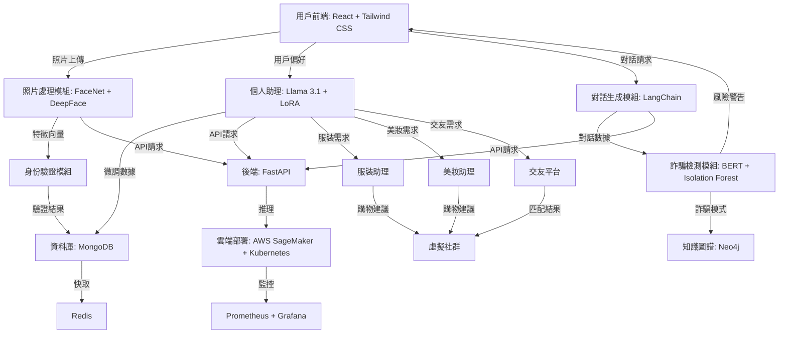

# AI 輔助個人助理與交友平台系統架構說明

本系統結合多模態處理（圖像、語音、文字）與個人化推薦，實現一套智慧型個人助理平台，提供用戶自拍辨識、對話互動、詐騙預警、服飾/美妝建議與交友配對等功能。

---

## 🧠 架構圖：Mermaid 語法

---

## 📌 系統模組說明

| 模組名稱 | 技術堆疊 | 功能說明 |
|----------|-----------|-----------|
| 用戶前端 (A) | React, Tailwind CSS | 用戶上傳照片、輸入偏好、發起對話與接收互動回饋。 |
| 照片處理模組 (B) | FaceNet, DeepFace | 進行臉部辨識並提取特徵向量供身分驗證使用。 |
| 身份驗證模組 (E) | 自定義邏輯 | 與資料庫比對臉部特徵向量以進行身分確認。 |
| 個人助理 (C) | Llama 3.1, LoRA | 理解用戶需求，支援服裝、美妝、交友等子任務。 |
| 對話生成模組 (D) | LangChain | 與用戶自然語言互動並串接多功能模組。 |
| 詐騙檢測模組 (G) | BERT + Isolation Forest | 偵測對話中的潛在詐騙模式並警示用戶。 |
| 知識圖譜 (H) | Neo4j | 儲存已知詐騙模式並強化後續偵測能力。 |
| 資料庫 (F) | MongoDB | 儲存用戶資料、互動紀錄、偏好設定等。 |
| 快取服務 (I) | Redis | 提高資料存取效率，加快個人化推薦反應。 |
| 後端 API (J) | FastAPI | 提供所有模組與前端的資料溝通介面。 |
| 雲端推理平台 (K) | AWS SageMaker, Kubernetes | 執行深度學習模型推理任務與彈性部署。 |
| 系統監控 (L) | Prometheus + Grafana | 即時監控系統運作狀態與效能指標。 |
| 服裝助理 (M) | 自定義推薦引擎 | 根據用戶身形、偏好提供穿搭建議與連結商品。 |
| 美妝助理 (N) | 自定義推薦引擎 | 分析膚色與肌膚狀況給出個性化妝品推薦。 |
| AI 交友平台 (O) | LLM 配對邏輯 | 根據偏好與互動記錄匹配虛擬人物與人際互動。 |
| 虛擬社群 (P) | 自定義社群模組 | 整合推薦結果與互動體驗，提升平台黏著度。 |

---

## 🔄 系統流程摘要

1. **用戶註冊與上傳照片** → 臉部特徵提取與身分驗證。
2. **偏好輸入與任務選擇** → 個人助理進行意圖理解。
3. **語意分析與對話生成** → 串接推薦模組或詐騙檢測。
4. **推薦結果回傳前端** → 提供購物建議、風險提醒或社群互動。
5. **API 請求統一由 FastAPI 管理**，推理交由 AWS SageMaker 完成。
6. **系統監控由 Prometheus + Grafana 實現可視化儀表板。**

---

## 🔐 安全性與資料隱私考量

- 所有特徵向量與使用紀錄經過加密後儲存。
- Redis 提供快取但不永久保存個資。
- 詐騙檢測使用 Isolation Forest + NLP 模型進行即時風險判斷。

---

## 💡 未來擴充方向

- 整合 voice-to-text 功能進一步拓展語音助理互動。
- 加入 AI 形象生成模組（如AnimateDiff）供用戶建立虛擬形象。
- 強化詐騙偵測模型與社群行為分析機制。
