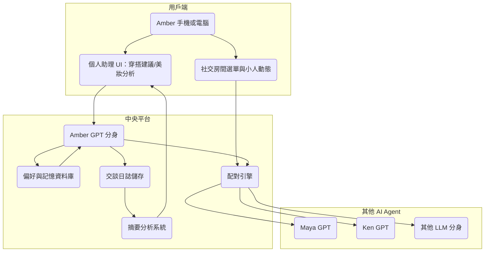

# AI 交友平台技術結構開發文檔

## 一、項目简介

AI 交友平台是一個培育個人 AI 分身的智慧助理系統，初始作為個人化時尚／美妝助理介面，能提供服裝穿搭建議與保養彩妝推薦。進階階段進入 AI 交友平台，可透過「點選小房間」進入不同主題社交場域，讓 AI 分身自動替使用者建立人脈與交流圈。平台支援動態角色展示（Avatar 小人）以提升沉浸感與互動趣味性。

---

## 二、系統機能歷程圖 (Mermaid)

---

## 三、系統機能概覽

### 1. Amber GPT 分身

- 作用：模擬 Amber 的性格、興趣、語氣風格，並代表使用者與其他代理人互動。
- 技術：Prompt Engineering + LangChain + OpenAI GPT + Tool Calling + Long-term Memory

### 2. 偏好與記憶資料庫

- 作用：記錄用戶風格偏好、穿搭喜好、喜歡聊天的主題與關鍵人。
- 技術：FAISS / Weaviate / Pinecone + sqlite + LangChain memory

### 3. 配對引擎（含主題房間進入）

- 作用：根據使用者設定或人格匹配機制自動將 AI 引導進入主題房間與他人互動。
- 技術：RAG + metadata scoring + 使用者選單 API

### 4. 交談日誌儲存

- 作用：儲存每日對話紀錄與房間內互動記錄，以利回顧與摘要。
- 技術：MongoDB / Firebase / Google Sheets API

### 5. 摘要分析系統

- 作用：統整用戶與其他 AI 分身互動的週報、推薦持續發展對象或風格類型。
- 技術：OpenAI GPT summary + cronjob scheduler

### 6. 個人助理模組

- 作用：透過拍照、輸入三圍與場合需求，提供個性化服裝/彩妝/保養建議。
- 技術：CLIP/BLIP 多模態圖文模型 + GPT 解釋 + 各品牌資料庫 API

### 7. Avatar 動態角色系統（可選）

- 作用：用可愛或擬真的小人代表 AI 分身，視覺化呈現進入房間與互動。
- 技術：SVG / WebGL 2D avatar + 動畫觸發 API + Chat Status 顯示模組

---

## 四、 MVP 實作推薦

### MVP 功能分約

| 功能              | 實作技術                             |
|-------------------|--------------------------------------|
| 初始分身定義        | Prompt + LangChain memory            |
| 個人助理服裝/美妝建議 | CLIP/BLIP + GPT 解說 + 選品 API         |
| 房間聊天 UI       | Streamlit / Gradio / Web UI          |
| AI 相互聊天       | Autogen Arena / ChatArena            |
| 儲存聊天記錄       | Google Sheets / MongoDB              |
| 自動總算與推薦     | GPT summary + ranking                |
| 小人視覺化模組     | SVG avatar 動畫 / WebGL 架構          |

---

## 五、操作流程

1. Amber 開啟平台，透過 UI 填寫喜好資料，並使用個人助理功能獲取搭配建議
2. Amber 點選進入想參加的主題房間（如藝術、旅遊、科技...）
3. Amber GPT 分身進入房間與其他 AI 交流，互動過程小人會動態表現
4. 互動記錄會自動儲存，並每日/每週產生摘要報告與推薦名單
5. Amber 可查看與回覆，決定是否加深互動或切換話題風格

---

## 六、預計操作環境

- OpenAI GPT-4 / GPT-4o 作為主要幫手 LLM
- Python + LangChain 主導線系統
- Gradio 或 Streamlit 打造前端與個人助理介面
- Autogen Arena 實作多代理人社交互動模組
- Google Sheets / Firebase 作為聊天記錄與偏好暫存資料庫
- 可選模組：WebGL + SVG 小人動畫架構（如 Lottie + React）

---

Amber 可以根據這份文件開始建立包含個人助理 + AI 分身社交的完整體驗。如果需要，我可以協助你搭出第一版 DEMO 與 UI 模擬。
