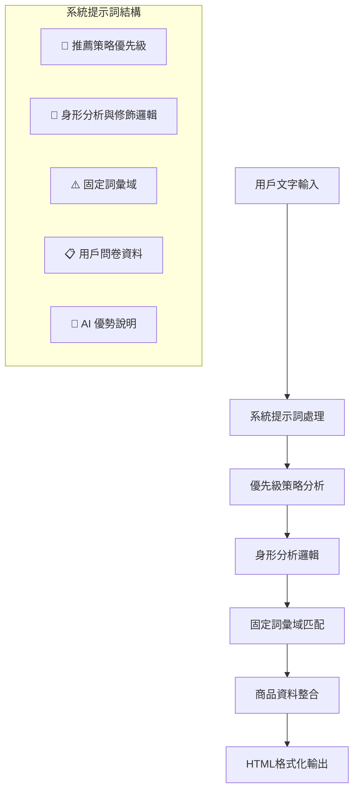
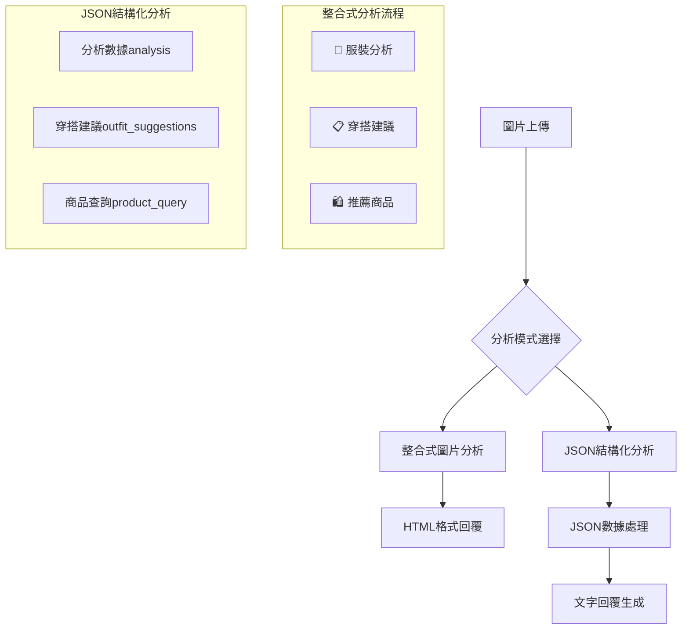

# STYLEMATE AI 回覆分層結構分析報告

## 📋 總覽

STYLEMATE 系統採用了精心設計的多層次 AI 回覆架構，分別針對**文字檢核**和**圖片檢核**提供不同的分層回覆模式，確保用戶獲得結構化、專業且易讀的時尚建議。

## 🎯 文字檢核回覆分層結構

### 1. 系統提示詞層級架構



### 2. 文字回覆三層結構

#### 第一層：分析結果 (`<h3>🎯 分析結果</h3>`)
```html
<h3>🎯 分析結果</h3>
<p>簡短總結用戶需求和分析重點</p>
```
- **功能**: 快速總結用戶需求
- **內容**: 身形特徵、場合需求、風格偏好
- **長度**: 1-2 句精簡說明

#### 第二層：推薦方案 (`<h3>📋 推薦方案</h3>`)
```html
<h3>📋 推薦方案</h3>
<ol>
<li><strong>商品類型一：</strong><br/>
    <strong>[商品ID] 商品名稱</strong><br/>
    推薦理由：具體說明適合的原因和特點。</li>
<li><strong>商品類型二：</strong><br/>
    <strong>[商品ID] 商品名稱</strong><br/>
    推薦理由：具體說明適合的原因和特點。</li>
<li><strong>商品類型三：</strong><br/>
    <strong>[商品ID] 商品名稱</strong><br/>
    推薦理由：具體說明適合的原因和特點。</li>
</ol>
```
- **功能**: 核心商品推薦
- **內容**: 2-3 個具體商品 + 推薦理由
- **格式**: 有序列表 + 商品ID標記

#### 第三層：搭配建議 (`<h3>💡 搭配建議</h3>`)
```html
<h3>💡 搭配建議</h3>
<ol>
<li>搭配要點一：具體建議內容</li>
<li>搭配要點二：具體建議內容</li>
<li>搭配要點三：具體建議內容</li>
</ol>
```
- **功能**: 實用穿搭指導
- **內容**: 色彩搭配、配件選擇、場合建議
- **格式**: 有序列表，3個要點

### 3. 數據整合層

#### Fashion-CLIP 語義搜尋整合
```typescript
// Fashion-CLIP 上下文生成
fashionClipContext = `
**🤖 Fashion-CLIP AI 語義分析結果：**
找到 ${fashionClipResults.length} 個高度相關的商品
${fashionClipResults.slice(0, 3).map(item => 
  `• ${item.name_zh || item.name_en} (相似度: ${(item.similarity * 100).toFixed(0)}%)
  風格: ${item.style_tags_zh.join('、')}
  適合場合: ${item.occasion_zh.join('、')}`
).join('\n\n')}
`
```

#### RAG 知識庫整合
```typescript
// RAG 上下文生成
ragContext = `
**📚 相關知識庫資訊：**
${ragResult.results.map(r => 
  `來源：${r.source}
  內容：${r.content}
  相似度：${r.similarity.toFixed(2)}`
).join('\n\n')}
`
```

## 🖼️ 圖片檢核回覆分層結構

### 1. 圖片分析雙模式架構



### 2. 整合式圖片分析三層結構

#### 第一層：服裝分析 (`<h3>🎯 服裝分析</h3>`)
```html
<h3>🎯 服裝分析</h3>
<p>我看到這件服裝是...風格，適合...場合。具體分析服裝特點和風格定位。</p>
```
- **功能**: 直接分析圖片中的服裝
- **內容**: 風格定位、場合適宜性、服裝特點
- **格式**: 專業描述，以「我看到這件服裝是...」開頭

#### 第二層：穿搭建議 (`<h3>📋 穿搭建議</h3>`)
```html
<h3>📋 穿搭建議</h3>
<ol>
<li><strong>鞋款搭配：</strong><br/>
    建議搭配具體鞋款，說明選擇理由。</li>
<li><strong>配件選擇：</strong><br/>
    推薦適合的包包或飾品，解釋搭配效果。</li>
<li><strong>外套層次：</strong><br/>
    根據場合和天氣，建議適合的外套選擇。</li>
</ol>
```
- **功能**: 具體的穿搭指導
- **內容**: 鞋款、配件、外套搭配建議
- **格式**: 三個具體搭配類別

#### 第三層：推薦商品 (`<h3>🛍️ 推薦商品</h3>`)
```html
<h3>🛍️ 推薦商品</h3>
<ol>
<li><strong>[商品ID] 商品名稱</strong><br/>
    推薦理由：說明為什麼這個商品適合。</li>
<li><strong>[商品ID] 商品名稱</strong><br/>
    推薦理由：說明為什麼這個商品適合。</li>
</ol>
```
- **功能**: 相關商品推薦
- **內容**: 具體商品 + 推薦理由
- **格式**: 商品ID標記 + 詳細說明

### 3. JSON 結構化分析架構

#### 分析數據結構
```json
{
  "analysis": {
    "body_shape": "沙漏形/梨形/矩形/倒三角形/不確定",
    "style_keywords": ["從10種固定風格選擇"],
    "occasions": ["從場合白名單選擇"],
    "fit_preference": ["寬鬆/標準/合身"]
  }
}
```

#### 穿搭建議結構
```json
{
  "outfit_suggestions": [
    {
      "title": "方案標題（如：韓系休閒風）",
      "items": [
        {
          "category": "上衣",
          "style": "具體款式",
          "fit": "版型",
          "color": "顏色"
        }
      ],
      "reasons": ["修飾身形的具體原因", "風格搭配的理由"]
    }
  ]
}
```

#### 商品查詢結構
```json
{
  "product_query": [
    {
      "category": "商品類別",
      "style_tags": ["風格標籤"],
      "fit": ["版型偏好"],
      "color": ["顏色選項"],
      "occasion": ["適合場合"]
    }
  ]
}
```

## 🔧 回覆格式化邏輯

### 1. HTML 格式化處理

#### 標準格式要求
```typescript
/**
 * 重要格式要求：
 * - 必須使用HTML格式，確保段落分明、縮排對齊
 * - 回答必須分段結構化，使用清晰的1. 2. 3. 編號
 * - 每個段落都要獨立成行，不要擠成連續句子
 * - 使用適當的HTML標籤確保版面整潔
 */
```

#### HTML 標籤使用規範
- `<h3>`: 主要章節標題
- `<p>`: 段落內容
- `<ol>`: 有序列表
- `<li>`: 列表項目
- `<strong>`: 重點強調
- `<br/>`: 換行處理

### 2. 商品ID解析機制

```typescript
// 解析推薦的商品 ID
const recommendedProductIds = []
const idMatches = aiResponse.match(/\[([^\]]+)\]/g)
if (idMatches) {
  for (const match of idMatches) {
    const id = match.replace(/[[\]]/g, '')
    if (fashionItems.find(item => item.id.toString() === id)) {
      recommendedProductIds.push(id)
    }
  }
}
```

- **功能**: 從AI回覆中提取商品ID
- **格式**: `[商品ID]` 方括號標記
- **驗證**: 確保ID存在於商品資料庫中

### 3. 圖片分析回覆生成

```typescript
function generateImageAnalysisResponse(analysisData: any, fashionClipResults: any[]) {
  let response = `✨ **AI圖片分析完成！**\n\n`
  
  // 身形分析
  if (analysis?.body_shape && analysis.body_shape !== "不確定") {
    response += `**身形特徵：** ${analysis.body_shape}\n`
  }
  
  // 風格建議
  if (analysis?.style_keywords?.length > 0) {
    response += `**推薦風格：** ${analysis.style_keywords.join('、')}\n`
  }
  
  // 穿搭建議結構化輸出
  if (outfit_suggestions?.length > 0) {
    response += `**🎯 為您推薦 ${outfit_suggestions.length} 套穿搭方案：**\n\n`
    outfit_suggestions.slice(0, 3).forEach((outfit: any, index: number) => {
      response += `**${index + 1}. ${outfit.title}**\n`
      // 詳細項目展示
    })
  }
  
  return response
}
```

## 📊 分層結構優勢分析

### 1. 用戶體驗優勢

#### 階層清晰
- **快速掃描**: 用戶可以快速瀏覽三個主要層次
- **重點突出**: 每層都有明確的功能定位
- **易於理解**: 邏輯順序符合用戶思考流程

#### 內容豐富
- **多角度分析**: 從分析到推薦到搭配的完整流程
- **具體可行**: 提供實際可購買的商品ID
- **專業指導**: 包含專業的時尚搭配建議

### 2. 技術實現優勢

#### 結構化數據
- **易於解析**: HTML標籤便於前端渲染
- **數據提取**: 商品ID可自動識別和處理
- **格式一致**: 統一的回覆格式便於維護

#### 擴展性強
- **模組化設計**: 每層可獨立調整和優化
- **數據整合**: 支援多種數據源整合
- **彈性配置**: 可根據不同場景調整回覆結構

### 3. AI 模型優勢

#### 提示詞設計
- **角色定位明確**: 專業時尚顧問身份
- **固定詞彙域**: 確保回覆的一致性和專業性
- **優先級策略**: 明確的分析順序和重點

#### 多模態支援
- **文字理解**: GPT-4 語言理解能力
- **圖片分析**: GPT-4V 視覺分析能力
- **語義搜尋**: Fashion-CLIP 專業時尚理解

## 🎯 分層設計原則

### 1. 信息層次化
- **由淺入深**: 從總結到具體到建議
- **重點優先**: 最重要的推薦商品放在中間層
- **補充完整**: 搭配建議提供完整的穿搭指導

### 2. 用戶導向
- **需求匹配**: 直接回應用戶的具體需求
- **行動指導**: 提供可執行的購買和搭配建議
- **專業可信**: 使用專業術語和分析方法

### 3. 技術可行
- **格式標準**: 統一的HTML格式便於處理
- **數據關聯**: 商品ID確保與資料庫的連接
- **性能優化**: 結構化輸出減少解析複雜度

## 📈 未來優化方向

### 1. 個人化增強
- **學習用戶偏好**: 根據歷史互動調整回覆風格
- **動態調整層次**: 根據用戶熟悉度調整詳細程度
- **情境感知**: 考慮時間、地點、天氣等因素

### 2. 互動性提升
- **分步引導**: 支援多輪對話的漸進式建議
- **即時反饋**: 根據用戶反應調整後續推薦
- **視覺化展示**: 結合圖片和文字的混合回覆

### 3. 技術升級
- **更精準的語義理解**: 提升Fashion-CLIP的準確度
- **多語言支援**: 擴展到更多語言的分層回覆
- **實時趨勢整合**: 動態更新流行趨勢信息

---

*本分析報告詳細解析了STYLEMATE系統的AI回覆分層結構，為系統優化和功能擴展提供了技術參考。*