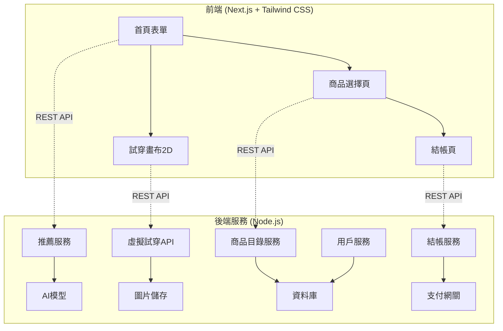

# STYLEMATE 開發者文檔

## 專案概述

STYLEMATE 是一個韓國服裝虛擬試穿平台，允許用戶上傳全身照片並通過 2D 疊加技術體驗不同服裝的試穿效果。

### 核心功能
- **風格偏好分析**：基於用戶輸入（K-pop風、日常穿搭等）進行 AI 選品
- **2D 虛擬試穿**：將用戶全身照片與服裝圖片進行 2D 疊加合成
- **個人化推薦**：根據風格偏好推薦韓國服裝商品
- **一站式購物**：包含商品瀏覽、虛擬試穿、結帳流程

### 技術架構



## 系統需求

### 開發環境
- **Node.js**: >= 16.0.0
- **MongoDB**: >= 4.4
- **Sharp**: ^0.33.0 (圖像處理)
- **Next.js**: >= 13.0.0
- **Tailwind CSS**: >= 3.0.0

### 生產環境
- **雲端儲存**: AWS S3 或 Cloudinary
- **資料庫**: MongoDB Atlas
- **部署平台**: Vercel (前端) + Railway/Heroku (後端)
- **CDN**: CloudFront 或 Cloudinary

## 專案結構

```
STYLEMATE/
├── frontend/                 # Next.js 前端應用
│   ├── pages/               # 頁面路由
│   │   ├── index.js        # 首頁表單
│   │   ├── tryon.js        # 試穿畫布
│   │   ├── products.js     # 商品選擇
│   │   └── checkout.js     # 結帳頁
│   ├── components/          # React 組件
│   │   ├── StyleForm.jsx   # 風格偏好表單
│   │   ├── TryOnCanvas.jsx # 2D 試穿畫布
│   │   ├── ProductGrid.jsx # 商品網格
│   │   └── CheckoutForm.jsx # 結帳表單
│   ├── styles/             # Tailwind CSS 樣式
│   ├── public/             # 靜態資源
│   └── utils/              # 工具函數
├── backend/                # Node.js 後端服務
│   ├── routes/             # API 路由
│   │   ├── recommendations.js # 推薦服務
│   │   ├── virtual-tryon.js   # 虛擬試穿
│   │   ├── products.js        # 商品服務
│   │   ├── checkout.js        # 結帳服務
│   │   └── users.js           # 用戶服務
│   ├── models/             # 資料模型
│   ├── middleware/         # 中間件
│   ├── services/           # 業務邏輯
│   └── utils/              # 工具函數
├── image-processing/       # 圖像處理模組
│   ├── image-processor.js
│   ├── virtual-tryOn-processor.js
│   └── image-utils.js
├── database/              # 資料庫配置和遷移
├── docs/                  # 文檔
└── tests/                 # 測試文件
```

## 開發流程

### 1. 環境設置
```bash
# 克隆專案
git clone <repository-url>
cd STYLEMATE

# 安裝依賴
npm install

# 設置環境變數
cp .env.example .env.local
```

### 2. 資料庫設置
```bash
# 啟動 MongoDB
mongod

# 初始化資料庫
npm run db:seed
```

### 3. 開發伺服器
```bash
# 啟動前端開發伺服器
npm run dev:frontend

# 啟動後端開發伺服器
npm run dev:backend
```

### 4. 測試
```bash
# 運行所有測試
npm test

# 運行特定測試
npm test -- --grep "虛擬試穿"
```

## 核心模組詳細說明

### 用戶體驗流程

1. **首頁表單輸入**
   - 用戶選擇風格偏好（K-pop風、日常穿搭、正式場合等）
   - 上傳全身照片（正面、良好光線、清晰背景）
   - 填寫基本資訊（身高、體型偏好等）

2. **AI 推薦生成**
   - 系統分析用戶偏好標籤
   - 從韓國服裝資料庫匹配商品
   - 生成個人化推薦清單

3. **2D 虛擬試穿**
   - 處理用戶全身照片（標準化尺寸、背景去除）
   - 對齊服裝圖片到用戶身型
   - 生成 2D 疊加試穿效果

4. **商品選擇與結帳**
   - 展示推薦商品與試穿效果
   - 用戶選擇心儀商品加入購物車
   - 完成結帳流程（固定定價模式）

## 技術特色

### 圖像處理技術
- **Sharp.js** 高效能圖像處理
- **2D 疊加算法** 實現虛擬試穿效果
- **自動對齊系統** 根據服裝類型智能調整位置
- **批次處理能力** 支持大量圖像同時處理

### AI 推薦系統
- **標籤匹配算法** 基於風格偏好推薦
- **協同過濾** 根據相似用戶行為推薦
- **內容過濾** 基於商品特徵推薦
- **實時學習** 根據用戶反饋調整推薦

### 資料管理
- **MongoDB** 靈活的文檔資料庫
- **雲端儲存** 高效率圖片存儲與 CDN
- **快取策略** Redis 快取熱門商品
- **資料同步** 實時更新庫存與價格

## 安全性考量

### 圖片上傳安全
- 檔案類型限制（JPEG, PNG, WebP）
- 檔案大小限制（最大 10MB）
- 惡意檔案掃描
- 圖片內容審核

### 資料保護
- 用戶照片加密儲存
- GDPR 合規資料處理
- 定期資料清理機制
- 敏感資訊脫敏

### API 安全
- JWT 身份驗證
- Rate Limiting 防護
- CORS 跨域保護
- SQL 注入防護

## 效能優化

### 前端優化
- 圖片懶加載
- 程式碼分割
- CDN 資源分發
- 瀏覽器快取

### 後端優化
- 資料庫索引優化
- 圖像處理快取
- API 響應快取
- 負載平衡

## 部署指南

### 環境配置
```bash
# 生產環境變數
NODE_ENV=production
MONGODB_URI=mongodb+srv://...
CLOUDINARY_URL=cloudinary://...
STRIPE_SECRET_KEY=sk_live_...
```

### Docker 部署
```dockerfile
# 使用官方 Node.js 鏡像
FROM node:16-alpine

# 設置工作目錄
WORKDIR /app

# 安裝依賴
COPY package*.json ./
RUN npm ci --only=production

# 複製程式碼
COPY . .

# 構建應用
RUN npm run build

# 暴露端口
EXPOSE 3000

# 啟動應用
CMD ["npm", "start"]
```

## 監控與維護

### 應用監控
- **錯誤追蹤**: Sentry 錯誤監控
- **效能監控**: New Relic 應用效能
- **日誌管理**: Winston 結構化日誌
- **健康檢查**: 定期服務狀態檢查

### 資料監控
- **資料庫效能**: MongoDB Compass 監控
- **儲存使用**: 雲端儲存用量追蹤
- **API 使用**: 請求頻率與響應時間
- **用戶行為**: Google Analytics 追蹤

---

## 快速開始

1. 克隆專案並安裝依賴
2. 設置環境變數
3. 初始化資料庫
4. 啟動開發伺服器
5. 瀏覽 http://localhost:3000

詳細的模組文檔請參考以下各章節。