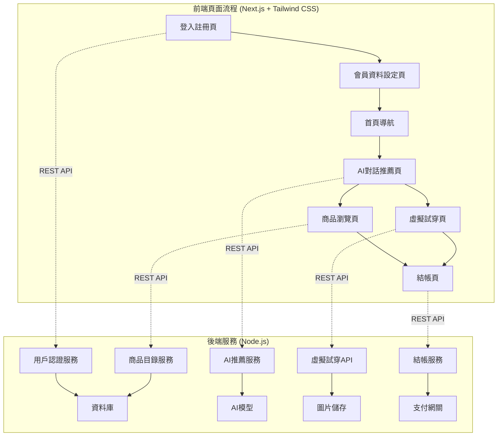

# STYLEMATE 開發者文檔

## 專案概述

STYLEMATE 是一個韓國服裝虛擬試穿平台，允許用戶上傳全身照片並通過 2D 疊加技術體驗不同服裝的試穿效果。

### 核心功能
- **風格偏好分析**：基於用戶輸入（K-pop風、日常穿搭等）進行 AI 選品
- **2D 虛擬試穿**：將用戶全身照片與服裝圖片進行 2D 疊加合成
- **個人化推薦**：根據風格偏好推薦韓國服裝商品
- **一站式購物**：包含商品瀏覽、虛擬試穿、結帳流程

### 技術架構



### 頁面規劃與開發狀態

| 頁面 | 路徑 | 功能描述 | 開發狀態 |
|------|------|----------|----------|
| **第1頁** | `/auth` | 登入註冊頁面 | ✅ 已完成 |
| **第2頁** | `/profile` | 會員資料設定頁 | ❌ 待開發 |
| **第3頁** | `/` | 首頁導航中心 | 🔄 需調整 |
| **第4頁** | `/chat` | AI對話推薦頁 | ❌ 待開發 |
| **第5頁** | `/products` | 商品瀏覽頁 | ✅ 已完成 |
| **第6頁** | `/tryon` | 虛擬試穿頁 | 🔄 基本完成 |
| **第7頁** | `/checkout` | 結帳頁面 | ❌ 待開發 |

## 系統需求

### 開發環境
- **Node.js**: >= 16.0.0
- **MongoDB**: >= 4.4
- **Sharp**: ^0.33.0 (圖像處理)
- **Next.js**: >= 13.0.0
- **Tailwind CSS**: >= 3.0.0

### 生產環境
- **雲端儲存**: AWS S3 或 Cloudinary
- **資料庫**: MongoDB Atlas
- **部署平台**: Vercel (前端) + Railway/Heroku (後端)
- **CDN**: CloudFront 或 Cloudinary

## 專案結構

```
STYLEMATE/
├── frontend/                 # Next.js 前端應用
│   ├── app/                 # Next.js 13+ App Router
│   │   ├── layout.tsx      # 根布局
│   │   ├── page.tsx        # 首頁導航
│   │   ├── auth/
│   │   │   └── page.tsx    # 登入註冊頁
│   │   ├── profile/
│   │   │   └── page.tsx    # 會員資料設定頁
│   │   ├── chat/
│   │   │   └── page.tsx    # AI對話推薦頁
│   │   ├── products/
│   │   │   └── page.tsx    # 商品瀏覽頁
│   │   ├── tryon/
│   │   │   └── page.tsx    # 虛擬試穿頁
│   │   └── checkout/
│   │       └── page.tsx    # 結帳頁
│   ├── components/          # React 組件
│   │   ├── ui/             # 基礎UI組件
│   │   ├── forms/          # 表單組件
│   │   ├── chat/           # 聊天相關組件
│   │   ├── canvas/         # 畫布組件
│   │   └── layout/         # 版面組件
│   ├── lib/                # 工具函數
│   ├── store/              # 狀態管理
│   ├── types/              # TypeScript 類型
│   ├── styles/             # 全域樣式
│   └── public/             # 靜態資源
├── backend/                # Node.js 後端服務
│   ├── routes/             # API 路由
│   │   ├── recommendations.js # 推薦服務
│   │   ├── virtual-tryon.js   # 虛擬試穿
│   │   ├── products.js        # 商品服務
│   │   ├── checkout.js        # 結帳服務
│   │   └── users.js           # 用戶服務
│   ├── models/             # 資料模型
│   ├── middleware/         # 中間件
│   ├── services/           # 業務邏輯
│   └── utils/              # 工具函數
├── image-processing/       # 圖像處理模組
│   ├── image-processor.js
│   ├── virtual-tryOn-processor.js
│   └── image-utils.js
├── database/              # 資料庫配置和遷移
├── docs/                  # 文檔
└── tests/                 # 測試文件
```

## 開發流程

### 1. 環境設置
```bash
# 克隆專案
git clone <repository-url>
cd STYLEMATE

# 安裝依賴
npm install

# 設置環境變數
cp .env.example .env.local
```

### 2. 資料庫設置
```bash
# 啟動 MongoDB
mongod

# 初始化資料庫
npm run db:seed
```

### 3. 開發伺服器
```bash
# 啟動前端開發伺服器
npm run dev:frontend

# 啟動後端開發伺服器
npm run dev:backend
```

### 4. 測試
```bash
# 運行所有測試
npm test

# 運行特定測試
npm test -- --grep "虛擬試穿"
```

## 核心模組詳細說明

### 用戶體驗流程

1. **用戶註冊登入** (`/auth`)
   - 社交登入或傳統註冊方式
   - 三步驟註冊流程：基本資料 → 身材資料 → 初步風格偏好

2. **詳細會員資料設定** (`/profile`)
   - 完整身材資料（身高、體重、三圍等）
   - 詳細風格偏好設定（甜美、優雅、街頭等）
   - 上傳全身照片（正面、良好光線、清晰背景）
   - 預算範圍設定

3. **首頁導航** (`/`)
   - 歡迎用戶並顯示個人資訊摘要
   - 導航到各主要功能頁面
   - 快速存取常用功能

4. **AI 智能推薦對話** (`/chat`)
   - AI 根據用戶資料推薦合適商品
   - 互動式對話介面（喜歡/不喜歡/詢問詳情）
   - 用戶選擇商品後可上傳新照片
   - **即時生成試穿合成圖**（商品+用戶照片）
   - 儲存、分享試穿結果

5. **商品瀏覽與探索** (`/products`)
   - 瀏覽完整商品目錄
   - 進階篩選和排序功能
   - 商品詳情檢視
   - 直接試穿或加入購物車

6. **虛擬試穿體驗** (`/tryon`)
   - 2D 虛擬試穿畫布
   - 手動調整試穿效果
   - 多角度檢視
   - 儲存試穿記錄

7. **結帳購買流程** (`/checkout`)
   - 購物車管理
   - 結帳表單填寫
   - 付款處理
   - 訂單確認

## 技術特色

### 圖像處理技術
- **Sharp.js** 高效能圖像處理
- **2D 疊加算法** 實現虛擬試穿效果
- **自動對齊系統** 根據服裝類型智能調整位置
- **批次處理能力** 支持大量圖像同時處理

### AI 推薦系統
- **標籤匹配算法** 基於風格偏好推薦
- **協同過濾** 根據相似用戶行為推薦
- **內容過濾** 基於商品特徵推薦
- **實時學習** 根據用戶反饋調整推薦

### 資料管理
- **MongoDB** 靈活的文檔資料庫
- **雲端儲存** 高效率圖片存儲與 CDN
- **快取策略** Redis 快取熱門商品
- **資料同步** 實時更新庫存與價格

## 安全性考量

### 圖片上傳安全
- 檔案類型限制（JPEG, PNG, WebP）
- 檔案大小限制（最大 10MB）
- 惡意檔案掃描
- 圖片內容審核

### 資料保護
- 用戶照片加密儲存
- GDPR 合規資料處理
- 定期資料清理機制
- 敏感資訊脫敏

### API 安全
- JWT 身份驗證
- Rate Limiting 防護
- CORS 跨域保護
- SQL 注入防護

## 效能優化

### 前端優化
- 圖片懶加載
- 程式碼分割
- CDN 資源分發
- 瀏覽器快取

### 後端優化
- 資料庫索引優化
- 圖像處理快取
- API 響應快取
- 負載平衡

## 部署指南

### 環境配置
```bash
# 生產環境變數
NODE_ENV=production
MONGODB_URI=mongodb+srv://...
CLOUDINARY_URL=cloudinary://...
STRIPE_SECRET_KEY=sk_live_...
```

### Docker 部署
```dockerfile
# 使用官方 Node.js 鏡像
FROM node:16-alpine

# 設置工作目錄
WORKDIR /app

# 安裝依賴
COPY package*.json ./
RUN npm ci --only=production

# 複製程式碼
COPY . .

# 構建應用
RUN npm run build

# 暴露端口
EXPOSE 3000

# 啟動應用
CMD ["npm", "start"]
```

## 開發檢查清單

### 頁面開發進度
- [x] **第1頁 - 登入註冊頁** (`/auth`)
  - [x] 社交登入功能
  - [x] 三步驟註冊流程
  - [x] 表單驗證
- [ ] **第2頁 - 會員資料設定頁** (`/profile`)
  - [ ] 詳細身材資料表單
  - [ ] 風格偏好設定介面
  - [ ] 照片上傳功能
  - [ ] 資料儲存與更新
- [ ] **第3頁 - 首頁導航** (`/`)
  - [ ] 用戶歡迎介面
  - [ ] 功能導航選單
  - [ ] 個人資訊摘要
- [ ] **第4頁 - AI對話推薦頁** (`/chat`)
  - [ ] AI 對話介面設計
  - [ ] 商品推薦邏輯
  - [ ] 用戶互動功能
  - [ ] 試穿圖合成整合
- [x] **第5頁 - 商品瀏覽頁** (`/products`)
  - [x] 商品網格展示
  - [x] 篩選排序功能
  - [x] 收藏功能
- [ ] **第6頁 - 虛擬試穿頁** (`/tryon`)
  - [x] 基本2D試穿畫布
  - [ ] 圖片合成優化
  - [ ] 調整工具完善
- [ ] **第7頁 - 結帳頁** (`/checkout`)
  - [ ] 購物車管理
  - [ ] 結帳表單
  - [ ] 付款整合

### 核心功能完整性
- [ ] 用戶認證與授權
- [ ] 個人資料管理
- [ ] AI 智能推薦
- [ ] 2D 虛擬試穿功能
- [ ] 商品瀏覽和篩選
- [ ] 購物車功能
- [ ] 結帳流程完整

### 效能優化
- [ ] 圖片懶載入實現
- [ ] API 請求快取
- [ ] 組件程式碼分割
- [ ] 靜態資源優化

### 用戶體驗
- [ ] 響應式設計適配
- [ ] 載入狀態反饋
- [ ] 錯誤處理顯示
- [ ] 成功操作提示

### 程式碼品質
- [ ] TypeScript 類型完整
- [ ] ESLint 規則通過
- [ ] 單元測試覆蓋率 > 80%
- [ ] 組件文檔完整

### 安全性
- [ ] XSS 防護
- [ ] CSRF 保護
- [ ] 圖片上傳安全檢查
- [ ] API 請求驗證

## 監控與維護

### 應用監控
- **錯誤追蹤**: Sentry 錯誤監控
- **效能監控**: New Relic 應用效能
- **日誌管理**: Winston 結構化日誌
- **健康檢查**: 定期服務狀態檢查

### 資料監控
- **資料庫效能**: MongoDB Compass 監控
- **儲存使用**: 雲端儲存用量追蹤
- **API 使用**: 請求頻率與響應時間
- **用戶行為**: Google Analytics 追蹤

---

## 快速開始

1. 克隆專案並安裝依賴
2. 設置環境變數
3. 初始化資料庫
4. 啟動開發伺服器
5. 瀏覽 http://localhost:3000

詳細的模組文檔請參考以下各章節。