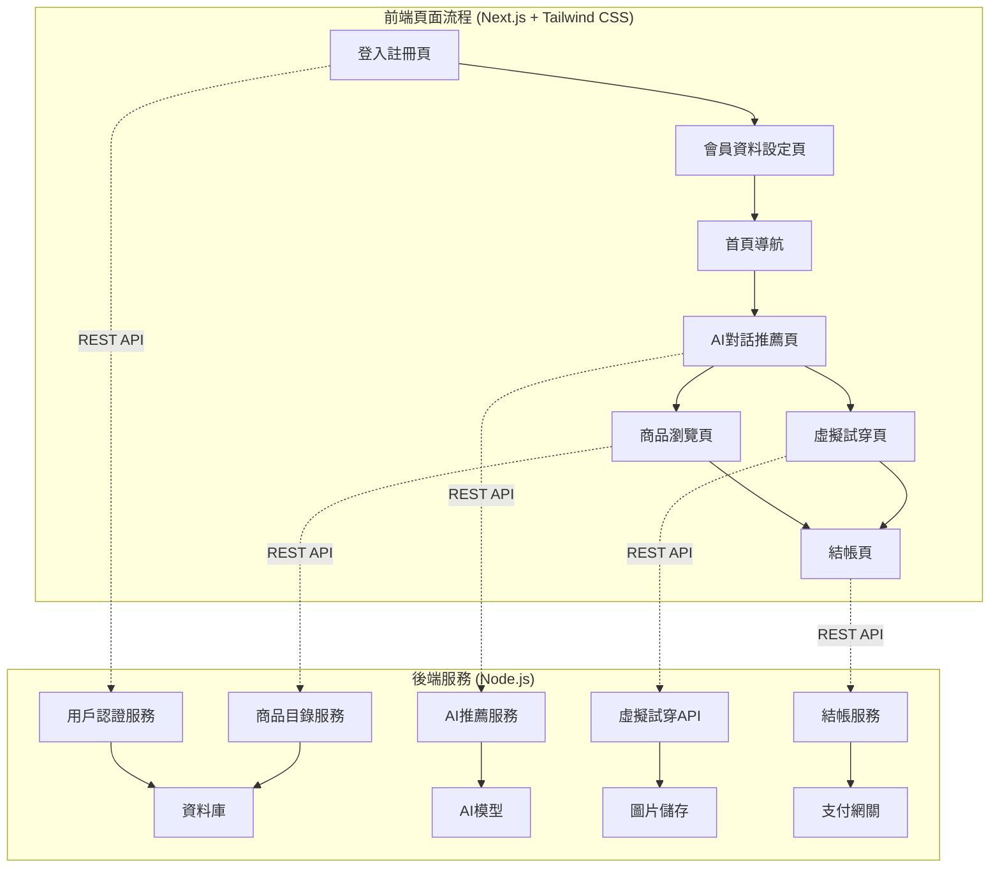
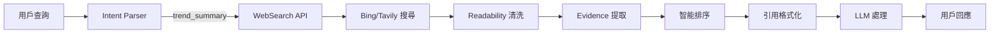

# STYLEMATE 開發者文檔

## 專案概述

STYLEMATE 是一個韓國服裝虛擬試穿平台，允許用戶上傳全身照片並通過 2D 疊加技術體驗不同服裝的試穿效果。

### 核心功能
- **風格偏好分析**：基於用戶輸入（K-pop風、日常穿搭等）進行 AI 選品
- **2D 虛擬試穿**：將用戶全身照片與服裝圖片進行 2D 疊加合成
- **個人化推薦**：根據風格偏好推薦韓國服裝商品
- **一站式購物**：包含商品瀏覽、虛擬試穿、結帳流程

### 技術架構


```mermaid
graph TB
    subgraph "前端頁面流程 (Next.js + Tailwind CSS)"
        A[登入註冊頁] --> B[會員資料設定頁]
        B --> C[首頁導航]
        C --> D[AI對話推薦頁]
        D --> E[商品瀏覽頁]
        D --> F[虛擬試穿頁]
        E --> G[結帳頁]
        F --> G
    end
    
    subgraph "後端服務 (Node.js)"
        H[用戶認證服務] --> M[資料庫]
        I[AI推薦服務] --> N[AI模型]
        J[虛擬試穿API] --> O[圖片儲存]
        K[商品目錄服務] --> M
        L[結帳服務] --> P[支付網關]
    end
    
    A -.->|REST API| H
    D -.->|REST API| I
    F -.->|REST API| J
    E -.->|REST API| K
    G -.->|REST API| L
```

### 頁面規劃與開發狀態

| 頁面 | 路徑 | 功能描述 | 開發狀態 |
|------|------|----------|----------|
| **第1頁** | `/auth` | 登入註冊頁面 | ✅ 已完成 |
| **第2頁** | `/profile` | 會員資料設定頁 | ❌ 待開發 |
| **第3頁** | `/` | 首頁導航中心 | ✅ 已完成 |
| **第4頁** | `/chat` | AI對話推薦頁 | ✅ **已完成** - OpenAI 整合 + RAG |
| **第5頁** | `/products` | 商品瀏覽頁 | ✅ 已完成 |
| **第6頁** | `/tryon` | 虛擬試穿頁 | ✅ 已完成 |
| **第7頁** | `/checkout` | 結帳頁面 | ✅ 已完成 |
| **管理頁** | `/admin/rag` | RAG 知識庫管理 | ✅ **新增** |

## 系統需求

### 開發環境
- **Node.js**: >= 16.0.0
- **Next.js**: 14.2.31
- **TypeScript**: 最新版
- **Tailwind CSS**: >= 3.0.0
- **OpenAI**: GPT-4 API 整合
- **RAG 系統**: pdf-parse + langchain
- **圖像處理**: Sharp (圖片處理)

### 生產環境
- **雲端儲存**: AWS S3 或 Cloudinary
- **資料庫**: MongoDB Atlas
- **部署平台**: Vercel (前端) + Railway/Heroku (後端)
- **CDN**: CloudFront 或 Cloudinary

## 專案結構

```
STYLEMATE/
├── frontend/                    # Next.js 前端應用 (實際架構)
│   ├── app/                    # Next.js 14+ App Router
│   │   ├── layout.tsx         # 根布局
│   │   ├── page.tsx           # 首頁導航
│   │   ├── globals.css        # 全域樣式
│   │   ├── auth/
│   │   │   └── page.tsx       # ✅ 登入註冊頁
│   │   ├── chat/
│   │   │   └── page.tsx       # ✅ AI對話推薦頁 (OpenAI + RAG + WebSearch)
│   │   ├── products/
│   │   │   └── page.tsx       # ✅ 商品瀏覽頁
│   │   ├── tryon/
│   │   │   └── page.tsx       # ✅ 虛擬試穿頁
│   │   ├── checkout/
│   │   │   └── page.tsx       # ✅ 結帳頁
│   │   ├── admin/
│   │   │   └── rag/
│   │   │       └── page.tsx   # ✅ RAG 知識庫管理
│   │   └── api/               # Next.js API Routes
│   │       ├── chat/
│   │       │   └── recommend/
│   │       │       └── route.ts # ✅ OpenAI 推薦 API (整合 WebSearch)
│   │       ├── ai/
│   │       │   └── analyze-product/
│   │       │       └── route.ts # ✅ 商品分析 API
│   │       ├── rag/
│   │       │   ├── upload-pdf/
│   │       │   │   └── route.ts # ✅ PDF 上傳處理
│   │       │   └── search/
│   │       │       └── route.ts # ✅ RAG 搜尋
│   │       └── test-ai/
│   │           └── route.ts    # ✅ AI 連接測試
│   ├── components/             # React 組件
│   │   ├── ui/                # 基礎UI組件
│   │   ├── forms/             # 表單組件 (PhotoUpload, StyleForm)
│   │   ├── canvas/            # 畫布組件
│   │   └── layout/            # 版面組件
│   ├── lib/
│   │   ├── products.ts        # ✅ 商品數據庫 (9個商品+標籤)
│   │   └── core/              # 🆕 Intent Parser & WebSearch 整合
│   │       ├── intentParser.ts # ✅ 智能路由分析器
│   │       └── intentRules.ts  # ✅ 路由規則配置
│   ├── store/                 # 狀態管理
│   ├── types/                 # TypeScript 類型定義
│   │   ├── api.ts
│   │   ├── product.ts
│   │   ├── tags.ts
│   │   └── user.ts
│   ├── public/
│   │   ├── icons/
│   │   ├── demo-search.html   # 🆕 WebSearch 測試頁面
│   │   └── images/
│   │       └── products/      # ✅ 真實商品圖片
│   ├── .env.local             # ✅ OpenAI API Key 設定
│   ├── knowledge/             # ✅ RAG 向量知識庫
│   ├── uploads/               # ✅ PDF 上傳儲存
│   ├── package.json
│   └── tailwind.config.js
├── backend/                   # 🆕 WebSearch 後端服務
│   ├── services/search/       # WebSearch 子系統
│   │   ├── webSearch.ts       # Bing + Tavily 搜尋供應商
│   │   ├── crawl.ts           # 內容抓取 + Readability 清洗
│   │   ├── extractors.ts      # Evidence 抽取器
│   │   ├── ranker.ts          # 智能排序與去重
│   │   └── orchestrator.ts    # 搜尋編排器
│   └── server.ts              # WebSearch API 服務 (port 3005)
├── picture/                   # 原始商品圖片素材 (77張)
├── 文檔資料/
│   ├── API_SPECIFICATION.md
│   ├── DEVELOPER_DOCUMENTATION.md # 本文件
│   ├── FRONTEND_SPECIFICATION.md
│   ├── UI_UX_DESIGN_GUIDE.md
│   └── MVP_Website_Structure.markdown
├── WEBSEARCH_INTEGRATION_GUIDE.md # 🆕 WebSearch 整合完成指南
├── .env.example               # 🆕 環境變數範例 (含 BING_KEY)
└── CLAUDE.md                  # ✅ Claude Code 專案記憶
```

## 開發流程

### 1. 環境設置
```bash
# 進入前端資料夾
cd frontend

# 安裝依賴
npm install

# 設置環境變數 - 創建 .env.local 文件並加入：
OPEN_AI_API_KEY=your_openai_api_key

# 🆕 WebSearch 服務配置 (在根目錄創建 .env)
BING_KEY=your_bing_search_v7_api_key_here    # 必填
TAVILY_KEY=your_tavily_api_key_here          # 可選備援
PORT=3005                                     # WebSearch 服務端口

# 🆕 新增以下環境變數
POSTGRES_CONNECTION_STRING=postgresql://localhost:5432/stylemate_fashion
QWEN_VL_API_KEY=your_qwen_api_key
FASHION_CLIP_MODEL_PATH=/models/fashion-clip
```

### 2. 開發伺服器
```bash
# 啟動 Next.js 前端伺服器
cd frontend && npm run dev
# 前端通常運行在 http://localhost:3000-3004

# 🆕 啟動 WebSearch 後端服務
npm run search
# WebSearch 服務運行在 http://localhost:3005
```

### 3. 測試功能
```bash
# 測試 OpenAI 連接
curl -X POST http://localhost:3004/api/test-ai -H "Content-Type: application/json" -d "{}"

# 🆕 測試 WebSearch 服務
curl -X GET http://localhost:3005/search?q=2025%20%E6%98%A5%E5%A4%8F%20%E9%9F%93%E5%9C%8B%20%E6%99%82%E5%B0%9A%E8%B6%A8%E5%8B%A2

# 訪問主要功能
# 聊天功能: http://localhost:3004/chat
# RAG 管理: http://localhost:3004/admin/rag
# 商品瀏覽: http://localhost:3004/products
# 🆕 WebSearch 示範: http://localhost:3005/demo-search.html
```

### 4. 測試
```bash
# 運行所有測試
npm test

# 運行特定測試
npm test -- --grep "虛擬試穿"
```

## 核心模組詳細說明

### 已實現的核心功能

#### 1. **AI 智能推薦對話系統** (`/chat`) ✅
- **OpenAI GPT-4 整合**: 真實 AI 對話推薦
- **RAG 知識庫系統**: PDF 文件上傳與向量搜尋
- **🆕 WebSearch 網路搜尋**: 即時抓取時尚趨勢資訊，支援引用來源
- **智能路由系統**: Intent Parser 自動識別查詢類型並啟用對應功能
- **智能商品推薦**: 基於 9 個韓式商品的精準推薦
- **互動式介面**: 用戶輸入 → AI 分析 → 商品展示
- **照片上傳功能**: 用戶可上傳全身照片
- **試穿圖生成**: 模擬試穿效果並跳轉到結果頁

#### 2. **商品管理系統** (`/lib/products.ts`) ✅
- **9 個完整商品**: 包含韓式連身裙、上衣、裙子、套裝等
- **完整商品數據**:
  - 價格、圖片、類別、風格
  - 標籤系統 (tags)
  - AI 元數據 (occasion, season, features)
  - 評分、評論數、顏色、尺寸
- **真實商品圖片**: 存放於 `/public/images/products/`

#### 3. **RAG 知識庫系統** ✅
- **PDF 上傳處理** (`/api/rag/upload-pdf`): 
  - 自動解析 PDF 內容
  - 文本分割與向量化
  - OpenAI text-embedding-ada-002 模型
- **智能搜尋** (`/api/rag/search`):
  - 余弦相似度計算
  - 相關內容檢索
  - 管理介面 `/admin/rag`

#### 4. **🆕 WebSearch 網路搜尋系統** ✅
- **多供應商架構**: Bing Web Search API (主要) + Tavily API (備援)
- **內容爬取**: Mozilla Readability 智能清洗網頁內容
- **Evidence 系統**: 自動抽取關鍵引用句並評分排序
- **時尚專業化**: 針對時裝周、流行趨勢查詢優化
- **智能路由**: Intent Parser 自動識別查詢類型並啟用搜尋
- **引用格式**: 類似 ChatGPT 的專業引用系統
- **服務架構**: 獨立後端服務 (port 3005) + API 整合

#### 5. **完整頁面架構** ✅
- **首頁** (`/`): 功能導航中心
- **認證頁** (`/auth`): 登入註冊界面
- **商品頁** (`/products`): 商品瀏覽與展示
- **試穿頁** (`/tryon`): 虛擬試穿結果展示
- **結帳頁** (`/checkout`): 完整購買流程

### 技術特色

#### OpenAI 整合
- **模型**: GPT-4 用於對話，text-embedding-ada-002 用於向量化
- **API 路由**: `/api/chat/recommend` 處理智能推薦
- **錯誤處理**: 完整的 try-catch 與 fallback 機制
- **API Key 安全**: 環境變數管理

#### RAG (Retrieval-Augmented Generation)
- **向量資料庫**: 本地 JSON 文件儲存
- **文本分割**: RecursiveCharacterTextSplitter
- **相似度閾值**: 0.7 以上才返回結果
- **批次處理**: 支援多個 PDF 文件同時處理

## 技術特色

### 圖像處理技術
- **Sharp.js** 高效能圖像處理
- **2D 疊加算法** 實現虛擬試穿效果
- **自動對齊系統** 根據服裝類型智能調整位置
- **批次處理能力** 支持大量圖像同時處理

### AI 推薦系統
- **標籤匹配算法** 基於風格偏好推薦
- **協同過濾** 根據相似用戶行為推薦
- **內容過濾** 基於商品特徵推薦
- **實時學習** 根據用戶反饋調整推薦

### 資料管理
- **MongoDB** 靈活的文檔資料庫
- **雲端儲存** 高效率圖片存儲與 CDN
- **快取策略** Redis 快取熱門商品
- **資料同步** 實時更新庫存與價格

## 安全性考量

### 圖片上傳安全
- 檔案類型限制（JPEG, PNG, WebP）
- 檔案大小限制（最大 10MB）
- 惡意檔案掃描
- 圖片內容審核

### 資料保護
- 用戶照片加密儲存
- GDPR 合規資料處理
- 定期資料清理機制
- 敏感資訊脫敏

### API 安全
- JWT 身份驗證
- Rate Limiting 防護
- CORS 跨域保護
- SQL 注入防護

## 效能優化

### 前端優化
- 圖片懶加載
- 程式碼分割
- CDN 資源分發
- 瀏覽器快取

### 後端優化
- 資料庫索引優化
- 圖像處理快取
- API 響應快取
- 負載平衡

## 部署指南

### 環境配置
```bash
# 生產環境變數
NODE_ENV=production
MONGODB_URI=mongodb+srv://...
CLOUDINARY_URL=cloudinary://...
STRIPE_SECRET_KEY=sk_live_...
```

### Docker 部署
```dockerfile
# 使用官方 Node.js 鏡像
FROM node:16-alpine

# 設置工作目錄
WORKDIR /app

# 安裝依賴
COPY package*.json ./
RUN npm ci --only=production

# 複製程式碼
COPY . .

# 構建應用
RUN npm run build

# 暴露端口
EXPOSE 3000

# 啟動應用
CMD ["npm", "start"]
```

## 開發檢查清單

### 頁面開發進度 (更新狀態)
- [x] **第1頁 - 登入註冊頁** (`/auth`) ✅
  - [x] 基本登入註冊界面
  - [x] 表單驗證
  - [x] 響應式設計
- [ ] **第2頁 - 會員資料設定頁** (`/profile`) ❌ 待開發
  - [ ] 詳細身材資料表單
  - [ ] 風格偏好設定介面
  - [ ] 照片上傳功能
  - [ ] 資料儲存與更新
- [x] **第3頁 - 首頁導航** (`/`) ✅
  - [x] 功能導航選單
  - [x] 美觀的界面設計
  - [x] 各頁面連結
- [x] **第4頁 - AI對話推薦頁** (`/chat`) ✅ **完全實現**
  - [x] OpenAI GPT-4 對話介面
  - [x] 智能商品推薦邏輯
  - [x] RAG 知識庫整合
  - [x] 用戶互動功能
  - [x] 照片上傳與試穿模擬
  - [x] 商品展示與選擇
- [x] **第5頁 - 商品瀏覽頁** (`/products`) ✅
  - [x] 9 個商品完整展示
  - [x] 標籤系統
  - [x] 商品詳情
  - [x] 響應式設計
- [x] **第6頁 - 虛擬試穿頁** (`/tryon`) ✅
  - [x] 試穿結果展示
  - [x] 圖片展示功能
  - [x] 用戶體驗優化
- [x] **第7頁 - 結帳頁** (`/checkout`) ✅
  - [x] 結帳界面設計
  - [x] 表單填寫功能
  - [x] 購買流程
- [x] **管理頁 - RAG 管理** (`/admin/rag`) ✅ **新增**
  - [x] PDF 文件上傳
  - [x] 知識庫搜尋測試
  - [x] 向量化處理狀態顯示

### 核心功能完整性 (更新)
- [x] **用戶認證與授權** - 基本認證界面已完成
- [ ] **個人資料管理** - 待開發 profile 頁面  
- [x] **AI 智能推薦** - OpenAI + RAG 完全實現 ✅
- [x] **虛擬試穿功能** - 試穿模擬與結果展示 ✅
- [x] **商品瀏覽和篩選** - 9 個商品完整展示 ✅
- [x] **購物流程** - 從聊天到結帳的完整流程 ✅
- [x] **RAG 知識庫** - PDF 上傳與智能搜尋 ✅

### 效能優化
- [ ] 圖片懶載入實現
- [ ] API 請求快取
- [ ] 組件程式碼分割
- [ ] 靜態資源優化

### 用戶體驗
- [ ] 響應式設計適配
- [ ] 載入狀態反饋
- [ ] 錯誤處理顯示
- [ ] 成功操作提示

### 程式碼品質
- [ ] TypeScript 類型完整
- [ ] ESLint 規則通過
- [ ] 單元測試覆蓋率 > 80%
- [ ] 組件文檔完整

### 安全性
- [ ] XSS 防護
- [ ] CSRF 保護
- [ ] 圖片上傳安全檢查
- [ ] API 請求驗證

## 監控與維護

### 應用監控
- **錯誤追蹤**: Sentry 錯誤監控
- **效能監控**: New Relic 應用效能
- **日誌管理**: Winston 結構化日誌
- **健康檢查**: 定期服務狀態檢查

### 資料監控
- **資料庫效能**: MongoDB Compass 監控
- **儲存使用**: 雲端儲存用量追蹤
- **API 使用**: 請求頻率與響應時間
- **用戶行為**: Google Analytics 追蹤

---

## 快速開始

1. 克隆專案並安裝依賴
2. 設置環境變數
3. 初始化資料庫
4. 啟動開發伺服器
5. 瀏覽 http://localhost:3000

## 🔥 最新更新：WebSearch 整合

**詳細整合指南**: [`WEBSEARCH_INTEGRATION_GUIDE.md`](./WEBSEARCH_INTEGRATION_GUIDE.md)

### WebSearch 系統架構


```mermaid
graph LR
    A[用戶查詢] --> B[Intent Parser]
    B -->|trend_summary| C[WebSearch API]
    C --> D[Bing/Tavily 搜尋]
    D --> E[Readability 清洗]
    E --> F[Evidence 提取]
    F --> G[智能排序]
    G --> H[引用格式化]
    H --> I[LLM 處理]
    I --> J[用戶回應]
```

### 核心功能
- ✅ **真實網路搜尋**: Bing Web Search API + Tavily 備援
- ✅ **內容智能清洗**: Mozilla Readability 抽取乾淨內容
- ✅ **專業引用系統**: 自動生成類似 ChatGPT 的引用格式
- ✅ **時尚領域優化**: 針對時裝周、流行趨勢查詢特別優化
- ✅ **零衝突路由**: Intent Parser 智能識別查詢類型
- ✅ **即插即用**: 已整合進現有聊天系統

## 🆕 圖片智能推薦系統 API 文檔

**完整技術規格**: [`INTELLIGENT_RECOMMEND_API.md`](./INTELLIGENT_RECOMMEND_API.md)

### 新增 API 端點總覽

| API 端點 | 方法 | 功能描述 | 狀態 |
|----------|------|----------|------|
| `/api/intelligent-recommend` | POST | 🆕 圖片智能推薦（Qwen2-VL + Fashion-CLIP） | 開發中 |
| `/api/fashion-clip/search` | POST | 🆕 語義搜尋（文字/圖片檢索） | 開發中 |
| `/api/fashion-clip/encode` | POST | 🆕 特徵編碼（向量轉換） | 開發中 |
| `/api/fashion-clip/vectorize` | POST | 🆕 批次向量化處理 | 開發中 |

### 整合流程範例

```javascript
// 完整的圖片智能推薦流程
async function intelligentRecommend(imageFile, userPreferences) {
  // 1. 圖片轉base64
  const imageBase64 = await fileToBase64(imageFile);
  
  // 2. 調用智能推薦API
  const response = await fetch('/api/intelligent-recommend', {
    method: 'POST',
    headers: { 'Content-Type': 'application/json' },
    body: JSON.stringify({
      image: imageBase64,
      analysis_type: 'body_shape',
      user_message: '幫我找適合的韓式穿搭',
      preferences: userPreferences
    })
  });
  
  const result = await response.json();
  
  if (result.success) {
    // 3. 展示推薦結果
    displayRecommendations(result.recommendations);
    
    // 4. 記錄分析結果
    console.log('AI分析:', result.analysis);
  }
}
```

### 系統架構升級

```
現有架構 (v1.0):
用戶輸入文字 → OpenAI GPT-4 → 商品推薦

新增架構 (v2.0):
用戶上傳圖片 → Qwen2-VL 視覺分析 → 標準化查詢詞 → Fashion-CLIP 語義搜尋 → 個人化推薦結果
            ↑                                    ↓
        PostgreSQL + pgvector 向量資料庫
```

### 環境配置更新

新增以下環境變數到 `.env.local`:

```bash
# 🆕 向量資料庫
POSTGRES_CONNECTION_STRING=postgresql://localhost:5432/stylemate_fashion

# 🆕 AI 模型配置  
QWEN_VL_API_KEY=your_qwen_vl_api_key
FASHION_CLIP_MODEL_PATH=/models/fashion-clip

# 🆕 向量搜尋配置
VECTOR_DIMENSION=512
DEFAULT_SIMILARITY_THRESHOLD=0.7
```

---

詳細的模組文檔請參考以上各章節及 [圖片智能推薦 API 技術規格](./INTELLIGENT_RECOMMEND_API.md)。