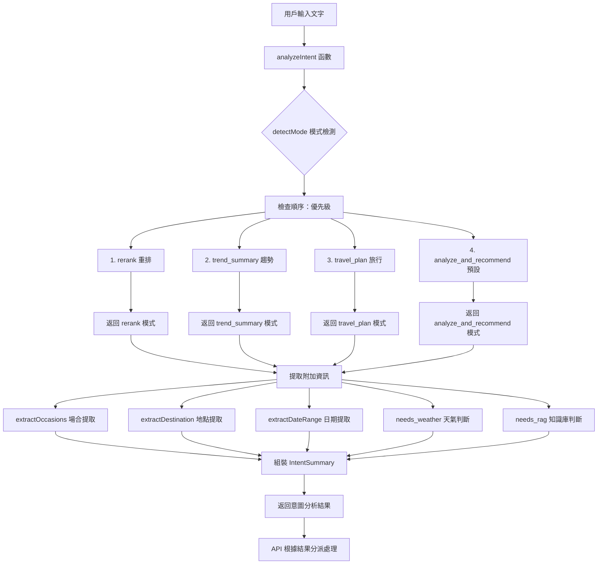
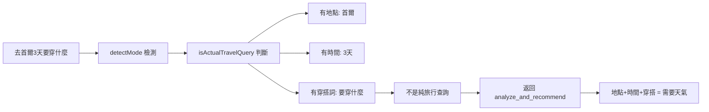
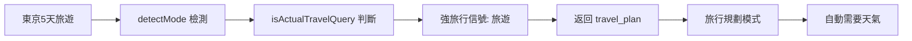

ㄍㄧㄠ# STYLEMATE Intent Parser 流程詳解

## 🧠 Intent Parser 核心機制

STYLEMATE 的 Intent Parser 是一個智能意圖識別系統，能夠分析用戶輸入的文字，自動判斷用戶意圖並分派到相應的處理流程。

## 🔄 完整處理流程



## 📊 四種核心模式

### 1. **rerank** (重排模式)
```typescript
// 關鍵字：重排|rerank|這幾件|幫我排序|top\d+
// 優先級：最高 (第一個檢查)
MODE_KEYWORDS.rerank: [
  /重排|rerank|這幾件|幫我排序|top\s*\d+/i
]
```
**用例**: "幫我把這幾件重排序", "top 5 推薦"

### 2. **trend_summary** (流行趨勢模式)
```typescript
// 關鍵字：時裝周|fashion week|趨勢|流行|本季|今年
// 優先級：第二高 (專業術語優先)
MODE_KEYWORDS.trend_summary: [
  /時裝周|fashion week/i,
  /巴黎時裝周|紐約時裝周|米蘭時裝周|倫敦時裝周/i,
  /何時.*時裝周|什麼時候.*時裝周/i,
  /趨勢|流行|本季|今年|熱門|關鍵色/i
]
```
**用例**: "2025年韓國流行趨勢", "今年春夏時裝周重點"

### 3. **travel_plan** (旅行規劃模式)
```typescript
// 需要通過嚴格的 isActualTravelQuery 判斷
// 強信號：旅行|旅遊|出差|行程|幫我查天氣
// 弱信號：需要地點+時間但排除穿搭語境
function isActualTravelQuery(text: string): boolean {
  const strongTravelSignals = /旅行|旅遊|出差|行程|幫我查天氣|天氣預報/i;
  if (strongTravelSignals.test(text)) return true;
  
  // 複合判斷：地點+時間但非時尚語境
  const hasDuration = /\b(\d{1,2})\s*(天|day|days)\b/i.test(text);
  const hasLocation = extractDestination(text);
  const isFashionContext = /時裝周|fashion week|流行|趨勢/i.test(text);
  const isClothingQuery = /穿|搭配|服裝|衣服|what.*wear/i.test(text);
  
  return hasDuration && hasLocation && !isFashionContext && !isClothingQuery;
}
```
**用例**: "東京5天旅遊", "出差三天行程安排"

### 4. **analyze_and_recommend** (分析推薦模式)
```typescript
// 預設模式：所有不符合上述三種模式的查詢
// 最常見的穿搭推薦和服裝分析
```
**用例**: "適合約會的洋裝", "顯瘦的上衣推薦"

## 🎯 智能分派邏輯示例

### 案例 1: "2025年韓國流行趨勢"
```mermaid
graph LR
    A["2025年韓國流行趨勢"] --> B[detectMode 檢測]
    B --> C[匹配 trend_summary 關鍵字]
    C --> D[/趨勢|流行/ 匹配成功]
    D --> E[返回 trend_summary 模式]
    E --> F[啟動流行趨勢搜尋]
    F --> G[不觸發天氣查詢]
```

**處理結果**:
```typescript
{
  mode: "trend_summary",
  text_query: "2025年韓國流行趨勢",
  needs_weather: false,  // ✅ 不查天氣
  needs_rag: false
}
```

### 案例 2: "去首爾3天要穿什麼"


**處理結果**:
```typescript
{
  mode: "analyze_and_recommend",
  text_query: "去首爾3天要穿什麼",
  needs_weather: true,   // ✅ 需要天氣
  destinations: ["Seoul, KR"],
  date_range: { start: "AUTO_TODAY", end: "+3d" }
}
```

### 案例 3: "東京5天旅遊"


**處理結果**:
```typescript
{
  mode: "travel_plan",
  text_query: "東京5天旅遊",
  needs_weather: true,   // ✅ 旅行自動需要天氣
  destinations: ["Tokyo, JP"],
  date_range: { start: "AUTO_TODAY", end: "+5d" }
}
```

## 🔍 關鍵字匹配機制

### 正則表達式規則
```typescript
// 使用 hasAny 函數進行模式匹配
const hasAny = (text: string, patterns: (RegExp)[]) => 
  patterns.some(rx => rx.test(text));

// 範例：trend_summary 模式匹配
const trendPatterns = [
  /時裝周|fashion week/i,           // 時裝周相關
  /巴黎時裝周|紐約時裝周/i,        // 具體城市時裝周
  /趨勢|流行|本季|今年|熱門/i      // 一般流行趨勢
];
```

### 場合提取 (OCCASION_HINTS)
```typescript
export const OCCASION_HINTS = [
  { rx: /婚禮|wedding|喜宴/i, val: "正式" },
  { rx: /面試|interview/i, val: "正式" },
  { rx: /通勤|上班|office/i, val: "通勤" },
  { rx: /約會|date/i, val: "約會" },
  { rx: /旅遊|旅行|trip|tour/i, val: "旅遊" },
  { rx: /派對|party/i, val: "派對" },
  { rx: /簡報|presentation/i, val: "商務簡報" }
];
```

### 地點白名單 (CITY_WHITELIST)
```typescript
export const CITY_WHITELIST = [
  "Tokyo, JP", "Osaka, JP", "Seoul, KR", "Busan, KR",
  "Taipei, TW", "Hong Kong, HK", "Bangkok, TH",
  "New York, US", "Paris, FR", "London, UK", "Milan, IT"
];
```

## 🌤️ 天氣需求判斷邏輯

```typescript
const needs_weather =
  mode === "travel_plan" ||  // 旅行模式自動需要天氣
  /天氣|下雨|UV|紫外線|風大|冷|熱|查天氣|天氣預報/i.test(text) ||  // 明確天氣詞
  // 穿搭查詢 + 地點 + 時間 = 需要天氣 (但排除趨勢查詢)
  (mode === "analyze_and_recommend" && 
   !!destinations && 
   (!!date_range || /\d+天|天數|幾天/i.test(text)) && 
   /穿|搭配|服裝|衣服/i.test(text));
```

**判斷邏輯**:
1. **travel_plan 模式**: 自動需要天氣
2. **明確天氣詞彙**: 包含天氣相關關鍵字
3. **複合條件**: 穿搭查詢 + 有地點 + 有時間

## 📚 RAG 知識庫判斷

```typescript
export const NEEDS_RAG_HINTS = [
  /婚禮|宗教|教堂|寺廟|禮儀|dress\s*code|黑領帶|black\s*tie|business\s*casual/i,
  /材質|麂皮|絲綢|防水|防滑|鞋跟|鞋底/i
];

const needs_rag = NEEDS_RAG_HINTS.some(rx => rx.test(text)) || 
                 occasions.includes("正式");
```

**觸發條件**:
- **禮儀場合**: 婚禮、宗教、dress code
- **專業材質**: 麂皮、絲綢、防水等
- **正式場合**: 自動觸發 RAG

## 🎨 API 處理分派

```typescript
// API 中的使用方式
const intentAnalysis = analyzeIntent({ text: message });

// 根據模式分派處理
if (intentAnalysis.mode === 'trend_summary') {
  // ✅ 搜尋時尚趨勢，不查天氣
  trendContext = await fetchFashionTrends(message);
}

if (intentAnalysis.needs_weather && intentAnalysis.destinations) {
  // ✅ 需要天氣且有地點時查詢天氣
  weatherContext = await fetchWeatherInfo(intentAnalysis.destinations);
}

// Fashion-CLIP 語義搜尋始終執行
fashionClipResults = await searchFashionClip(message);
```

## 🧪 測試案例驗證

### ✅ 正確分派案例

| 用戶輸入 | 預期模式 | 天氣需求 | 實際結果 |
|---------|---------|---------|---------|
| "2025年韓國流行趨勢" | trend_summary | ❌ | ✅ 正確 |
| "去首爾3天要穿什麼" | analyze_and_recommend | ✅ | ✅ 正確 |
| "東京5天旅遊" | travel_plan | ✅ | ✅ 正確 |
| "適合約會的洋裝" | analyze_and_recommend | ❌ | ✅ 正確 |
| "巴黎時裝周重點" | trend_summary | ❌ | ✅ 正確 |

### 🔧 邊界情況處理

**模糊案例**: "首爾時裝周穿搭"
- **時裝周關鍵字** → trend_summary 模式
- **地點存在但非旅行語境** → 不需要天氣
- **結果**: ✅ 正確識別為趨勢查詢

## 🚀 系統優勢

### 1. **智能分派準確性**
- **優先級機制**: 避免關鍵字衝突
- **複合條件判斷**: 考慮多重語義環境
- **邊界情況處理**: 特殊語境的精確判斷

### 2. **高效處理流程**
- **早期分派**: 避免不必要的 API 調用
- **條件觸發**: 只在需要時查詢天氣/RAG
- **統一入口**: 所有意圖透過單一函數處理

### 3. **可擴展架構**
- **規則分離**: 意圖規則獨立於邏輯代碼
- **模式擴展**: 易於添加新的意圖模式
- **白名單管理**: 地點和場合的集中維護

---

*STYLEMATE Intent Parser 透過精密的語義分析和智能分派機制，確保用戶獲得最精準的時尚建議和服務。*