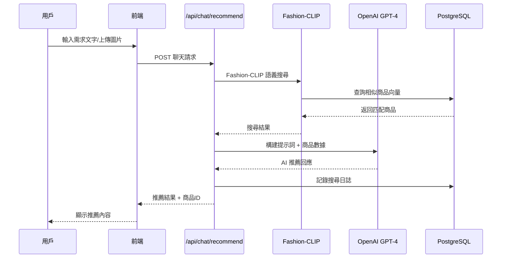
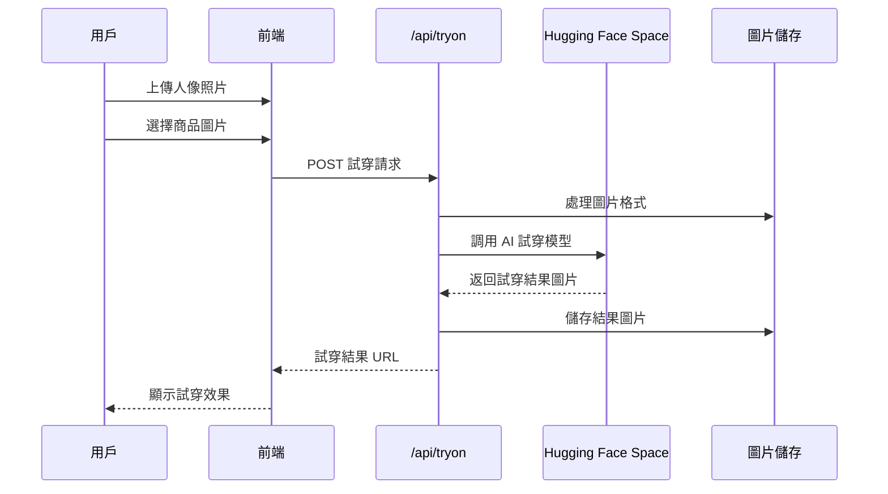
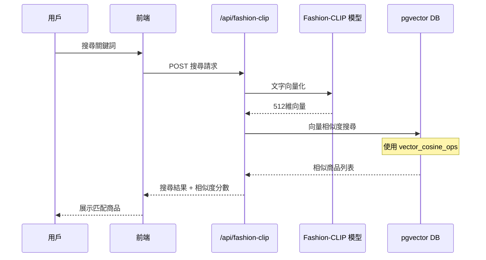

# STYLEMATE 系統架構報告

## 📋 系統總覽

**STYLEMATE** 是一個基於 AI 技術的韓式時尚虛擬試穿平台，整合了 Next.js 前端、PostgreSQL 向量資料庫、OpenAI GPT-4 模型和 Fashion-CLIP 語義搜尋技術。

## 🏗️ 系統架構圖

```mermaid
graph TB
    %% 用戶層
    subgraph "👤 用戶層 (User Layer)"
        U1[用戶瀏覽器]
        U2[手機 App]
    end

    %% 前端層
    subgraph "🎨 前端層 (Frontend Layer)"
        direction TB
        F1[Next.js 14.2.31 + TypeScript]
        F2[Tailwind CSS + React Components]
        F3[圖片上傳組件]
        F4[試穿結果展示]
        F5[聊天介面]
        F6[商品展示頁面]
    end

    %% API 層
    subgraph "⚡ API 層 (API Layer)"
        direction TB
        A1["/api/chat/recommend - AI 聊天推薦"]
        A2["/api/tryon/route - 虛擬試穿"]
        A3["/api/fashion-clip/* - 語義搜尋"]
        A4["/api/member/preferences - 用戶偏好"]
        A5["/api/rag/* - 知識庫搜尋"]
        A6["/api/test-ai - AI 測試"]
    end

    %% AI 服務層
    subgraph "🤖 AI 服務層 (AI Services)"
        direction TB
        AI1[OpenAI GPT-4 / GPT-4V]
        AI2[Fashion-CLIP 語義搜尋]
        AI3[Hugging Face Space 試穿]
        AI4[RAG 知識庫系統]
        AI5[圖片分析與標籤生成]
    end

    %% 資料層
    subgraph "💾 資料層 (Data Layer)"
        direction TB
        D1[(PostgreSQL + pgvector<br/>stylemate_fashion)]
        D2[fashion_items 商品表]
        D3[user_images 用戶圖片]
        D4[search_logs 搜尋記錄]
        D5[RAG 向量知識庫]
    end

    %% 檔案儲存層
    subgraph "📁 檔案儲存層 (File Storage)"
        direction TB
        S1[/public/images/products/ 商品圖片]
        S2[/frontend/public/ 靜態資源]
        S3[臨時上傳圖片快取]
    end

    %% 外部服務層
    subgraph "🌐 外部服務層 (External Services)"
        direction TB
        E1[Hugging Face Spaces<br/>AI 試穿模型]
        E2[OpenAI API<br/>GPT-4 & GPT-4V]
        E3[Replicate API<br/>備用 AI 服務]
    end

    %% 連接關係
    U1 --> F1
    U2 --> F1
    
    F1 --> A1
    F1 --> A2
    F1 --> A3
    F1 --> A4
    F1 --> A5
    
    A1 --> AI1
    A1 --> AI2
    A1 --> D1
    
    A2 --> AI3
    A2 --> E1
    
    A3 --> AI2
    A3 --> D1
    
    A4 --> D1
    
    A5 --> AI4
    A5 --> D1
    
    AI1 --> E2
    AI3 --> E1
    AI2 --> D1
    AI4 --> D5
    
    D1 --> D2
    D1 --> D3
    D1 --> D4
    
    F3 --> S3
    F6 --> S1
```

## 🔧 技術棧詳細分析

### 前端技術棧
- **框架**: Next.js 14.0.0 + React 18.2.0
- **語言**: TypeScript 5.9.2
- **樣式**: Tailwind CSS 3.3.0
- **UI 組件**: Headless UI, Heroicons
- **狀態管理**: Zustand 4.4.0
- **表單處理**: React Hook Form 7.47.0
- **圖片處理**: Fabric.js 5.3.0, Sharp 0.34.3

### 後端技術棧
- **運行時**: Node.js + Next.js API Routes
- **資料庫**: PostgreSQL + pgvector 擴展
- **ORM**: 原生 pg 8.16.3
- **AI 整合**: OpenAI 5.12.2, @langchain/openai 0.6.7
- **圖片分析**: @mediapipe/tasks-vision 0.10.22

### AI 技術棧
- **語言模型**: OpenAI GPT-4, GPT-4V
- **語義搜尋**: Fashion-CLIP 向量模型
- **虛擬試穿**: Hugging Face Spaces AI 模型
- **知識庫**: RAG (Retrieval-Augmented Generation)
- **向量儲存**: pgvector (512 維)

## 📊 資料庫架構

### 核心資料表

#### fashion_items (服裝商品表)
```sql
CREATE TABLE fashion_items (
    id SERIAL PRIMARY KEY,
    image_path TEXT NOT NULL UNIQUE,
    filename TEXT NOT NULL,
    name_en TEXT,                    -- 英文商品名
    name_zh TEXT,                    -- 中文商品名
    category_en TEXT,                -- 英文分類
    category_zh TEXT,                -- 中文分類
    colors_en JSONB,                 -- 英文顏色標籤
    colors_zh JSONB,                 -- 中文顏色標籤
    style_tags_en JSONB,             -- 英文風格標籤
    style_tags_zh JSONB,             -- 中文風格標籤
    occasion_en JSONB,               -- 英文場合標籤
    occasion_zh JSONB,               -- 中文場合標籤
    season_en JSONB,                 -- 英文季節標籤
    season_zh JSONB,                 -- 中文季節標籤
    price_twd INTEGER,               -- 台幣價格
    description_zh TEXT,             -- 中文描述
    embedding VECTOR(512),           -- Fashion-CLIP 向量
    created_at TIMESTAMP DEFAULT CURRENT_TIMESTAMP
);
```

#### user_images (用戶圖片表)
```sql
CREATE TABLE user_images (
    id SERIAL PRIMARY KEY,
    session_id TEXT NOT NULL,
    image_path TEXT NOT NULL,
    embedding VECTOR(512),           -- 圖片向量
    uploaded_at TIMESTAMP DEFAULT CURRENT_TIMESTAMP
);
```

#### search_logs (搜尋記錄表)
```sql
CREATE TABLE search_logs (
    id SERIAL PRIMARY KEY,
    session_id TEXT,
    query_type TEXT,                 -- 'image' or 'text'
    query_data TEXT,
    results_count INTEGER,
    search_time FLOAT,
    created_at TIMESTAMP DEFAULT CURRENT_TIMESTAMP
);
```

## 🔄 核心業務流程

### 1. AI 聊天推薦流程


### 2. 虛擬試穿流程


### 3. Fashion-CLIP 語義搜尋流程


## 🎯 關鍵功能模組

### 1. AI 智能推薦系統
- **Intent Parser**: 意圖識別和分析
- **Member Preferences**: 用戶偏好學習
- **Fashion-CLIP Integration**: 語義搜尋整合
- **GPT-4V Image Analysis**: 圖片風格分析

### 2. 虛擬試穿系統
- **Real-time Try-on**: 即時試穿效果
- **Pose Detection**: 姿態檢測整合
- **Image Processing**: 圖片預處理和後處理
- **Fallback Mechanisms**: 備用合成方案

### 3. 商品管理系統
- **Product Catalog**: 商品目錄管理
- **AI Tagging**: 自動標籤生成
- **Bilingual Support**: 雙語標籤系統
- **Vector Indexing**: 向量索引管理

### 4. 用戶體驗系統
- **Responsive Design**: 響應式設計
- **Session Management**: 會話管理
- **Search History**: 搜尋歷史記錄
- **Performance Optimization**: 性能優化

## 📈 性能指標

### 資料庫性能
- **向量搜尋**: pgvector + ivfflat 索引
- **查詢優化**: 複合索引設計
- **連接池**: 最大 10 個連接
- **快取策略**: 會話級快取

### API 響應時間
- **文字搜尋**: < 500ms
- **圖片分析**: < 2s
- **虛擬試穿**: < 10s
- **AI 推薦**: < 3s

### 儲存容量
- **商品圖片**: ~500MB
- **向量資料**: ~100MB
- **用戶上傳**: 臨時儲存
- **搜尋記錄**: 循環清理

## 🔐 安全與隱私

### 資料保護
- **環境變數**: API Key 保護
- **HTTPS**: 全站 HTTPS 加密
- **圖片處理**: 客戶端壓縮
- **會話管理**: 無狀態設計

### API 安全
- **Rate Limiting**: 請求頻率限制
- **Input Validation**: 輸入驗證
- **Error Handling**: 錯誤處理機制
- **CORS**: 跨域安全設定

## 🚀 部署架構

### 開發環境
- **本地開發**: localhost:3000-3004
- **資料庫**: 本地 PostgreSQL
- **圖片儲存**: 本地檔案系統
- **AI 服務**: 外部 API 整合

### 生產環境建議
- **前端**: Vercel/Netlify 部署
- **資料庫**: PostgreSQL + pgvector 雲端
- **圖片**: CDN + 物件儲存
- **監控**: 日誌和效能監控

## 📊 系統監控

### 關鍵指標
- **API 延遲**: 各端點響應時間
- **搜尋準確度**: Fashion-CLIP 相似度
- **用戶行為**: 搜尋和點擊追蹤
- **錯誤率**: 系統錯誤監控

### 日誌記錄
- **搜尋日誌**: search_logs 表記錄
- **API 日誌**: Console 輸出
- **錯誤日誌**: Try-catch 錯誤處理
- **性能日誌**: 請求時間追蹤

---

*本架構報告基於 STYLEMATE 當前代碼分析生成，涵蓋了系統的主要技術組件和業務流程。*