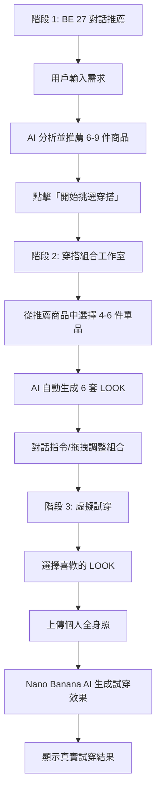

# BE 27 開發者文檔

## 🎯 專案概述

**BE 27** 是一個 AI 驅動的時尚穿搭助理系統，透過對話式介面提供個人化穿搭建議、智能組合生成與虛擬試穿功能。

### 核心特色
- 🤖 **AI 對話推薦**：OpenAI GPT-4o Mini 驅動的智能推薦系統
- 🎨 **互動式穿搭組合**：封閉單品池內的智能配對與交換系統
- 💬 **自然語言控制**：透過對話指令操作穿搭組合
- 👕 **拖拽式編輯**：直覺的拖放操作介面
- 📸 **虛擬試穿整合**：Nano Banana AI 真實試穿效果生成

---

## 📐 系統架構

### 完整用戶流程（3 階段）



---

## 🎨 階段 2：穿搭組合工作室設計

### 畫面佈局

```
┌──────────────────────────────────────────────────────────────┐
│ 左側 (1/5)              │ 右側 (4/5) - 穿搭展示區             │
│ ──────────────────────  │ ─────────────────────────────────── │
│ [摺疊 ☰]               │  ⬆️ 上排 LOOK 1-3                    │
│                         │  ┌────────┐  ┌────────┐  ┌────────┐ │
│ 🤖 BE 27 對話           │  │ LOOK 1 │  │ LOOK 2 │  │ LOOK 3 │ │
│                         │  │┌──────┐│  │┌──────┐│  │┌──────┐│ │
│ "我幫你組了 6 套搭配"   │  ││上衣A ││  ││上衣B ││  ││上衣C ││ │
│                         │  │└──────┘│  │└──────┘│  │└──────┘│ │
│ 💬 輸入框：             │  │┌──────┐│  │┌──────┐│  │┌──────┐│ │
│ "把 LOOK 1 的褲子       │  ││褲子1 ││  ││褲子2 ││  ││褲子3 ││ │
│  換成 LOOK 3 的褲子"    │  │└──────┘│  │└──────┘│  │└──────┘│ │
│                         │  │ 💰$3000│  │ 💰$3500│  │ 💰$2800│ │
│ [發送] 👈              │  │[試穿]  │  │[試穿]  │  │[試穿]  │ │
│                         │  └────────┘  └────────┘  └────────┘ │
│                         │                                      │
│ 🎲 快速指令：           │  ⬇️ 下排 LOOK 4-6                    │
│ • LOOK 1↔LOOK 2 上衣   │  ┌────────┐  ┌────────┐  ┌────────┐ │
│ • 重新隨機組合          │  │ LOOK 4 │  │ LOOK 5 │  │ LOOK 6 │ │
│ • 只顯示前 3 套         │  │┌──────┐│  │┌──────┐│  │┌──────┐│ │
│                         │  ││上衣A ││  ││上衣B ││  ││上衣C ││ │
│ 📦 當前單品池：         │  │└──────┘│  │└──────┘│  │└──────┘│ │
│                         │  │┌──────┐│  │┌──────┐│  │┌──────┐│ │
│ 上衣 (3件):             │  ││褲子1 ││  ││褲子2 ││  ││褲子3 ││ │
│ ┌────┐┌────┐┌────┐    │  │└──────┘│  │└──────┘│  │└──────┘│ │
│ │上衣A││上衣B││上衣C│    │  │ 💰$2700│  │ 💰$3200│  │ 💰$2500│ │
│ └────┘└────┘└────┘    │  │[試穿]  │  │[試穿]  │  │[試穿]  │ │
│ (可拖拽到 LOOK)         │  └────────┘  └────────┘  └────────┘ │
│                         │                                      │
│ 下身 (3件):             │  💡 目前使用的單品：                 │
│ ┌────┐┌────┐┌────┐    │  上衣: A, B, C                       │
│ │褲1  ││褲2  ││褲3  │    │  下身: 褲子1, 褲子2, 褲子3           │
│ └────┘└────┘└────┘    │                                      │
└─────────────────────────┴──────────────────────────────────────┘
```

### 核心設計理念

#### 1. **封閉單品池系統**
- 用戶從推薦商品中選擇 **3 件上衣 + 3 件下身**
- 這 6 件單品組成「單品池」
- 所有 LOOK 都從這個單品池組合而來
- 不會引入新商品，確保組合的可控性

#### 2. **6 套 LOOK 組合**
- 自動生成 6 套不同的穿搭組合
- 每套 LOOK = 1 件上衣 + 1 件下身
- 上下兩排展示（LOOK 1-3 上排，LOOK 4-6 下排）
- 每套顯示總價和試穿按鈕

#### 3. **雙向互動控制**
- **對話指令**：用戶透過自然語言控制組合
- **拖拽操作**：直接拖動單品到 LOOK 卡片替換

---

## 💬 對話指令系統

### Prompt 指令類型

#### 指令類型 1：單品交換
```javascript
用戶輸入範例：
✅ "把 LOOK 1 的褲子換成 LOOK 3 的褲子"
✅ "LOOK 1 和 LOOK 3 交換褲子"
✅ "LOOK 2 的上衣換成 LOOK 5 的上衣"
✅ "LOOK 1 和 LOOK 2 互換上衣"

執行結果：
LOOK 1: 上衣A + 褲子1  →  上衣A + 褲子3
LOOK 3: 上衣C + 褲子3  →  上衣C + 褲子1
```

#### 指令類型 2：顯示控制
```javascript
用戶輸入範例：
✅ "只顯示前 3 套"         → 隱藏 LOOK 4-6
✅ "顯示全部 6 套"         → 顯示 LOOK 1-6
✅ "只要 LOOK 1-4"         → 顯示前 4 套
```

#### 指令類型 3：批次重組
```javascript
用戶輸入範例：
✅ "重新組合全部搭配"      → 用現有單品重新隨機配對
✅ "把所有褲子都換一換"    → LOOK 1-6 的褲子重新分配
✅ "LOOK 1-3 的上衣都換掉"  → 前 3 套的上衣重新分配
```

---

## 🔧 技術實現

### 1. Zustand 狀態管理

```typescript
// frontend/store/outfitStore.ts

interface Product {
  id: string
  name: string
  image: string
  price: number
  category: 'top' | 'bottom'
  style: string[]
  tags: string[]
}

interface Look {
  id: number
  topIndex: number     // 指向 selectedTops 的索引
  bottomIndex: number  // 指向 selectedBottoms 的索引
  style?: string       // "休閒約會", "韓系清新"
}

interface OutfitState {
  // 已選單品池（固定數量）
  selectedTops: Product[]      // 3件上衣
  selectedBottoms: Product[]   // 3件下身

  // 6套LOOK的配對
  looks: Look[]  // 6 個 LOOK

  // 顯示控制
  visibleLookCount: number  // 3 or 6

  // 動作
  setSelectedProducts: (tops: Product[], bottoms: Product[]) => void
  generateLooks: () => void
  swapLookItems: (lookA: number, lookB: number, itemType: 'top'|'bottom') => void
  replaceLookItem: (lookIndex: number, itemType: 'top'|'bottom', itemIndex: number) => void
  setVisibleLookCount: (count: number) => void
  shuffleAllLooks: () => void
}

export const useOutfitStore = create<OutfitState>((set, get) => ({
  selectedTops: [],
  selectedBottoms: [],
  looks: [],
  visibleLookCount: 6,

  setSelectedProducts: (tops, bottoms) => {
    set({ selectedTops: tops, selectedBottoms: bottoms })
    get().generateLooks()
  },

  generateLooks: () => {
    const { selectedTops, selectedBottoms } = get()

    // 生成 6 套 LOOK
    const newLooks: Look[] = [
      { id: 1, topIndex: 0, bottomIndex: 0 },  // LOOK 1
      { id: 2, topIndex: 1, bottomIndex: 1 },  // LOOK 2
      { id: 3, topIndex: 2, bottomIndex: 2 },  // LOOK 3
      { id: 4, topIndex: 0, bottomIndex: 1 },  // LOOK 4
      { id: 5, topIndex: 1, bottomIndex: 2 },  // LOOK 5
      { id: 6, topIndex: 2, bottomIndex: 0 },  // LOOK 6
    ]

    set({ looks: newLooks })
  },

  swapLookItems: (lookA, lookB, itemType) => {
    set((state) => {
      const newLooks = [...state.looks]

      if (itemType === 'top') {
        const temp = newLooks[lookA].topIndex
        newLooks[lookA].topIndex = newLooks[lookB].topIndex
        newLooks[lookB].topIndex = temp
      } else {
        const temp = newLooks[lookA].bottomIndex
        newLooks[lookA].bottomIndex = newLooks[lookB].bottomIndex
        newLooks[lookB].bottomIndex = temp
      }

      return { looks: newLooks }
    })
  },

  replaceLookItem: (lookIndex, itemType, newItemIndex) => {
    set((state) => {
      const newLooks = [...state.looks]

      if (itemType === 'top') {
        newLooks[lookIndex].topIndex = newItemIndex
      } else {
        newLooks[lookIndex].bottomIndex = newItemIndex
      }

      return { looks: newLooks }
    })
  },

  setVisibleLookCount: (count) => {
    set({ visibleLookCount: count })
  },

  shuffleAllLooks: () => {
    set((state) => {
      const { selectedTops, selectedBottoms } = state

      // 隨機重組
      const newLooks: Look[] = Array.from({ length: 6 }, (_, i) => ({
        id: i + 1,
        topIndex: Math.floor(Math.random() * selectedTops.length),
        bottomIndex: Math.floor(Math.random() * selectedBottoms.length),
      }))

      return { looks: newLooks }
    })
  },
}))
```

### 2. Prompt 解析器

```typescript
// frontend/lib/core/outfitCommandParser.ts

interface SwapCommand {
  type: 'SWAP_ITEMS'
  lookA: number
  lookB: number
  itemType: 'top' | 'bottom'
}

interface DisplayCommand {
  type: 'SET_VISIBLE_COUNT'
  count: number
}

interface ShuffleCommand {
  type: 'SHUFFLE_ALL' | 'SHUFFLE_RANGE'
  range?: [number, number]
}

type OutfitCommand = SwapCommand | DisplayCommand | ShuffleCommand

export function parseOutfitCommand(userInput: string): OutfitCommand | null {
  const patterns = {
    // "把 LOOK 1 的褲子換成 LOOK 3 的褲子"
    swapSpecific: /把\s*LOOK\s*(\d+)\s*的\s*(上衣|褲子|下身)\s*換成\s*LOOK\s*(\d+)\s*的\s*(上衣|褲子|下身)/,

    // "LOOK 1 和 LOOK 3 交換褲子"
    swapBetween: /LOOK\s*(\d+)\s*和\s*LOOK\s*(\d+)\s*(互換|交換)\s*(上衣|褲子|下身)/,

    // "只顯示前 3 套"
    showCount: /只?\s*顯示\s*(前\s*)?(\d+)\s*套/,

    // "顯示全部"
    showAll: /顯示\s*全部|全部\s*顯示/,

    // "重新組合全部"
    shuffleAll: /重新\s*組合|重新\s*配對|隨機\s*組合/,
  }

  // 解析交換指令
  if (patterns.swapSpecific.test(userInput)) {
    const match = userInput.match(patterns.swapSpecific)!
    return {
      type: 'SWAP_ITEMS',
      lookA: parseInt(match[1]) - 1,
      lookB: parseInt(match[3]) - 1,
      itemType: match[2] === '上衣' ? 'top' : 'bottom'
    }
  }

  if (patterns.swapBetween.test(userInput)) {
    const match = userInput.match(patterns.swapBetween)!
    return {
      type: 'SWAP_ITEMS',
      lookA: parseInt(match[1]) - 1,
      lookB: parseInt(match[2]) - 1,
      itemType: match[4] === '上衣' ? 'top' : 'bottom'
    }
  }

  // 解析顯示指令
  if (patterns.showCount.test(userInput)) {
    const match = userInput.match(patterns.showCount)!
    return {
      type: 'SET_VISIBLE_COUNT',
      count: parseInt(match[2])
    }
  }

  if (patterns.showAll.test(userInput)) {
    return {
      type: 'SET_VISIBLE_COUNT',
      count: 6
    }
  }

  // 解析重組指令
  if (patterns.shuffleAll.test(userInput)) {
    return {
      type: 'SHUFFLE_ALL'
    }
  }

  return null
}

// 執行指令
export function executeOutfitCommand(
  command: OutfitCommand,
  store: ReturnType<typeof useOutfitStore.getState>
) {
  switch (command.type) {
    case 'SWAP_ITEMS':
      store.swapLookItems(command.lookA, command.lookB, command.itemType)
      return `已經幫你交換 LOOK ${command.lookA + 1} 和 LOOK ${command.lookB + 1} 的${command.itemType === 'top' ? '上衣' : '褲子'}了！`

    case 'SET_VISIBLE_COUNT':
      store.setVisibleLookCount(command.count)
      return `已經${command.count === 6 ? '顯示全部' : '只顯示前 ' + command.count + ' 套'}了！`

    case 'SHUFFLE_ALL':
      store.shuffleAllLooks()
      return `已經幫你重新組合了 6 套新搭配！`

    default:
      return null
  }
}
```

### 3. React DnD 拖拽實現

```typescript
// frontend/components/outfit/DraggableProduct.tsx

import { useDrag } from 'react-dnd'

interface DraggableProductProps {
  product: Product
  itemType: 'top' | 'bottom'
  index: number
}

export function DraggableProduct({ product, itemType, index }: DraggableProductProps) {
  const [{ isDragging }, drag] = useDrag(() => ({
    type: itemType,
    item: { product, itemType, index },
    collect: (monitor) => ({
      isDragging: !!monitor.isDragging(),
    }),
  }))

  return (
    <div
      ref={drag}
      className={`cursor-move transition-opacity ${
        isDragging ? 'opacity-50' : 'opacity-100'
      }`}
    >
      
      <p className="text-sm mt-2">{product.name}</p>
      <p className="text-xs text-gray-500">NT$ {product.price}</p>
    </div>
  )
}
```

```typescript
// frontend/components/outfit/LookCard.tsx

import { useDrop } from 'react-dnd'
import { useOutfitStore } from '@/store/outfitStore'

interface LookCardProps {
  look: Look
  lookIndex: number
}

export function LookCard({ look, lookIndex }: LookCardProps) {
  const { selectedTops, selectedBottoms, replaceLookItem } = useOutfitStore()

  const top = selectedTops[look.topIndex]
  const bottom = selectedBottoms[look.bottomIndex]

  const [{ isOver: isOverTop }, dropTop] = useDrop(() => ({
    accept: 'top',
    drop: (item: { index: number }) => {
      replaceLookItem(lookIndex, 'top', item.index)
    },
    collect: (monitor) => ({
      isOver: !!monitor.isOver(),
    }),
  }))

  const [{ isOver: isOverBottom }, dropBottom] = useDrop(() => ({
    accept: 'bottom',
    drop: (item: { index: number }) => {
      replaceLookItem(lookIndex, 'bottom', item.index)
    },
    collect: (monitor) => ({
      isOver: !!monitor.isOver(),
    }),
  }))

  return (
    <div className="bg-white rounded-xl p-4 shadow-md">
      <h3 className="text-lg font-semibold mb-3">LOOK {lookIndex + 1}</h3>

      {/* 上衣區 - 可拖放 */}
      <div
        ref={dropTop}
        className={`mb-3 p-2 rounded-lg transition-colors ${
          isOverTop ? 'bg-purple-100' : 'bg-gray-50'
        }`}
      >
        
        <p className="text-sm mt-2">{top.name}</p>
        <p className="text-xs text-gray-500">NT$ {top.price}</p>
      </div>

      {/* 下身區 - 可拖放 */}
      <div
        ref={dropBottom}
        className={`mb-3 p-2 rounded-lg transition-colors ${
          isOverBottom ? 'bg-purple-100' : 'bg-gray-50'
        }`}
      >
        
        <p className="text-sm mt-2">{bottom.name}</p>
        <p className="text-xs text-gray-500">NT$ {bottom.price}</p>
      </div>

      {/* 總價與試穿按鈕 */}
      <div className="border-t pt-3 mt-3">
        <p className="text-lg font-bold text-purple-600">
          💰 NT$ {top.price + bottom.price}
        </p>
        <button className="w-full mt-2 py-2 bg-gray-900 text-white rounded-lg hover:bg-gray-800">
          試穿這套
        </button>
      </div>
    </div>
  )
}
```

### 4. BE 27 Chat 頁面整合

```typescript
// frontend/app/chat/page.tsx (部分代碼)

'use client'

import { useState } from 'react'
import { DndProvider } from 'react-dnd'
import { HTML5Backend } from 'react-dnd-html5-backend'
import { useOutfitStore } from '@/store/outfitStore'
import { parseOutfitCommand, executeOutfitCommand } from '@/lib/core/outfitCommandParser'
import { LookCard } from '@/components/outfit/LookCard'
import { DraggableProduct } from '@/components/outfit/DraggableProduct'

export default function ChatPage() {
  const [mode, setMode] = useState<'chat' | 'outfit'>('chat')
  const {
    selectedTops,
    selectedBottoms,
    looks,
    visibleLookCount,
    setSelectedProducts
  } = useOutfitStore()

  // 當用戶點擊「開始挑選穿搭」
  const handleStartOutfit = (recommendedProducts: Product[]) => {
    // 從推薦商品中選擇上衣和下身
    const tops = recommendedProducts.filter(p => p.category === 'top').slice(0, 3)
    const bottoms = recommendedProducts.filter(p => p.category === 'bottom').slice(0, 3)

    setSelectedProducts(tops, bottoms)
    setMode('outfit')
  }

  // 處理對話指令
  const handleMessage = async (message: string) => {
    // 嘗試解析為穿搭指令
    const command = parseOutfitCommand(message)

    if (command && mode === 'outfit') {
      const response = executeOutfitCommand(command, useOutfitStore.getState())
      if (response) {
        // 顯示 BE 27 的回應
        setMessages(prev => [...prev, {
          type: 'ai',
          content: response
        }])
        return
      }
    }

    // 否則發送到 OpenAI API
    // ... (原有的 API 調用邏輯)
  }

  return (
    <DndProvider backend={HTML5Backend}>
      <div className="h-screen bg-white flex">
        {/* 左側對話區 */}
        <div className="w-1/5 bg-gray-50 border-r">
          {/* BE 27 對話介面 */}
        </div>

        {/* 右側展示區 */}
        <div className="flex-1">
          {mode === 'chat' ? (
            // 階段 1: 商品推薦
            <div>
              {/* 原有的聊天訊息流 + 商品推薦 */}
              <button onClick={handleStartOutfit}>
                開始挑選穿搭
              </button>
            </div>
          ) : (
            // 階段 2: 穿搭組合
            <div className="p-6">
              {/* 上排 LOOK 1-3 */}
              <div className="grid grid-cols-3 gap-4 mb-6">
                {looks.slice(0, 3).map((look, index) => (
                  <LookCard key={look.id} look={look} lookIndex={index} />
                ))}
              </div>

              {/* 下排 LOOK 4-6 */}
              {visibleLookCount === 6 && (
                <div className="grid grid-cols-3 gap-4">
                  {looks.slice(3, 6).map((look, index) => (
                    <LookCard key={look.id} look={look} lookIndex={index + 3} />
                  ))}
                </div>
              )}

              {/* 單品池 */}
              <div className="mt-6 p-4 bg-gray-50 rounded-xl">
                <h3 className="text-lg font-semibold mb-3">當前單品池</h3>

                <div className="mb-4">
                  <p className="text-sm text-gray-600 mb-2">上衣 ({selectedTops.length}件)</p>
                  <div className="grid grid-cols-3 gap-2">
                    {selectedTops.map((top, index) => (
                      <DraggableProduct
                        key={top.id}
                        product={top}
                        itemType="top"
                        index={index}
                      />
                    ))}
                  </div>
                </div>

                <div>
                  <p className="text-sm text-gray-600 mb-2">下身 ({selectedBottoms.length}件)</p>
                  <div className="grid grid-cols-3 gap-2">
                    {selectedBottoms.map((bottom, index) => (
                      <DraggableProduct
                        key={bottom.id}
                        product={bottom}
                        itemType="bottom"
                        index={index}
                      />
                    ))}
                  </div>
                </div>
              </div>
            </div>
          )}
        </div>
      </div>
    </DndProvider>
  )
}
```

---

## 🔌 階段 3：虛擬試穿整合

### Nano Banana API 串接

```typescript
// frontend/app/api/tryon/nano-banana/route.ts

import { NextRequest, NextResponse } from 'next/server'

export async function POST(request: NextRequest) {
  try {
    const { userPhoto, topImage, bottomImage, lookId } = await request.json()

    // 調用 Nano Banana API
    const response = await fetch(process.env.NANO_BANANA_API_URL!, {
      method: 'POST',
      headers: {
        'Content-Type': 'application/json',
        'Authorization': `Bearer ${process.env.NANO_BANANA_API_KEY}`
      },
      body: JSON.stringify({
        user_image: userPhoto,
        garment_images: [topImage, bottomImage],
        mode: 'full_outfit'
      })
    })

    const result = await response.json()

    if (result.success) {
      return NextResponse.json({
        success: true,
        tryonImage: result.output_image,
        lookId: lookId
      })
    } else {
      throw new Error(result.error || 'Virtual try-on failed')
    }

  } catch (error) {
    console.error('Nano Banana API error:', error)
    return NextResponse.json(
      { success: false, error: 'Virtual try-on service unavailable' },
      { status: 500 }
    )
  }
}
```

### 前端試穿流程

```typescript
// frontend/components/outfit/TryOnModal.tsx

'use client'

import { useState } from 'react'
import { useOutfitStore } from '@/store/outfitStore'

interface TryOnModalProps {
  lookIndex: number
  onClose: () => void
}

export function TryOnModal({ lookIndex, onClose }: TryOnModalProps) {
  const { selectedTops, selectedBottoms, looks } = useOutfitStore()
  const [userPhoto, setUserPhoto] = useState<string | null>(null)
  const [tryonResult, setTryonResult] = useState<string | null>(null)
  const [isLoading, setIsLoading] = useState(false)

  const look = looks[lookIndex]
  const top = selectedTops[look.topIndex]
  const bottom = selectedBottoms[look.bottomIndex]

  const handlePhotoUpload = (e: React.ChangeEvent<HTMLInputElement>) => {
    const file = e.target.files?.[0]
    if (file) {
      const reader = new FileReader()
      reader.onloadend = () => {
        setUserPhoto(reader.result as string)
      }
      reader.readAsDataURL(file)
    }
  }

  const handleTryOn = async () => {
    if (!userPhoto) return

    setIsLoading(true)

    try {
      const response = await fetch('/api/tryon/nano-banana', {
        method: 'POST',
        headers: { 'Content-Type': 'application/json' },
        body: JSON.stringify({
          userPhoto,
          topImage: top.image,
          bottomImage: bottom.image,
          lookId: look.id
        })
      })

      const result = await response.json()

      if (result.success) {
        setTryonResult(result.tryonImage)
      } else {
        alert('試穿失敗，請重試')
      }
    } catch (error) {
      console.error('Try-on error:', error)
      alert('試穿服務暫時無法使用')
    } finally {
      setIsLoading(false)
    }
  }

  return (
    <div className="fixed inset-0 bg-black bg-opacity-50 flex items-center justify-center z-50">
      <div className="bg-white rounded-xl p-6 max-w-2xl w-full">
        <h2 className="text-2xl font-bold mb-4">虛擬試穿 - LOOK {lookIndex + 1}</h2>

        {!tryonResult ? (
          <div>
            {/* 顯示選擇的搭配 */}
            <div className="grid grid-cols-2 gap-4 mb-6">
              <div>
                
                <p className="text-sm mt-2">{top.name}</p>
              </div>
              <div>
                
                <p className="text-sm mt-2">{bottom.name}</p>
              </div>
            </div>

            {/* 上傳照片 */}
            <div className="mb-6">
              <label className="block text-sm font-medium mb-2">
                上傳你的全身照片
              </label>
              <input
                type="file"
                accept="image/*"
                onChange={handlePhotoUpload}
                className="w-full"
              />
              {userPhoto && (
                
              )}
            </div>

            {/* 試穿按鈕 */}
            <button
              onClick={handleTryOn}
              disabled={!userPhoto || isLoading}
              className="w-full py-3 bg-purple-600 text-white rounded-lg hover:bg-purple-700 disabled:bg-gray-300"
            >
              {isLoading ? '處理中...' : '開始試穿'}
            </button>
          </div>
        ) : (
          <div>
            {/* 顯示試穿結果 */}
            
            <div className="flex gap-3">
              <button
                onClick={() => setTryonResult(null)}
                className="flex-1 py-2 bg-gray-200 rounded-lg"
              >
                重新試穿
              </button>
              <button
                onClick={onClose}
                className="flex-1 py-2 bg-purple-600 text-white rounded-lg"
              >
                確定
              </button>
            </div>
          </div>
        )}

        <button
          onClick={onClose}
          className="absolute top-4 right-4 text-gray-500 hover:text-gray-700"
        >
          ✕
        </button>
      </div>
    </div>
  )
}
```

---

## 📦 依賴安裝

```bash
# React DnD (拖拽功能)
npm install react-dnd react-dnd-html5-backend

# Zustand (狀態管理)
npm install zustand

# 已有的依賴
# - Next.js 14
# - OpenAI API
# - TailwindCSS
```

---

## 🚀 開發時程

### Week 1: 基礎架構 (5天)
- **Day 1**: Zustand 狀態管理建立
- **Day 2**: Prompt 解析器實作
- **Day 3**: 左右分欄佈局改版
- **Day 4**: LOOK 卡片組件
- **Day 5**: 單品池組件

### Week 2: 互動功能 (5天)
- **Day 6**: React DnD 拖拽實現
- **Day 7**: 對話指令整合
- **Day 8**: 顯示控制與重組功能
- **Day 9**: Nano Banana API 串接
- **Day 10**: 虛擬試穿流程整合

### Week 3: 優化與測試 (3天)
- **Day 11**: 響應式設計調整
- **Day 12**: 性能優化與錯誤處理
- **Day 13**: 用戶體驗優化與測試

---

## 🧪 測試策略

### 單元測試
```typescript
// __tests__/outfitCommandParser.test.ts

import { parseOutfitCommand } from '@/lib/core/outfitCommandParser'

describe('Outfit Command Parser', () => {
  it('should parse swap command correctly', () => {
    const command = parseOutfitCommand('把 LOOK 1 的褲子換成 LOOK 3 的褲子')

    expect(command).toEqual({
      type: 'SWAP_ITEMS',
      lookA: 0,
      lookB: 2,
      itemType: 'bottom'
    })
  })

  it('should parse display command correctly', () => {
    const command = parseOutfitCommand('只顯示前 3 套')

    expect(command).toEqual({
      type: 'SET_VISIBLE_COUNT',
      count: 3
    })
  })
})
```

### E2E 測試場景
1. 完整流程：對話推薦 → 選品 → 組合調整 → 虛擬試穿
2. 拖拽操作：拖動單品到 LOOK 卡片
3. 對話指令：交換、顯示控制、重組
4. 邊界情況：無效指令、API 錯誤

---

## 📝 API 端點總覽

| 端點 | 方法 | 功能 | 狀態 |
|------|------|------|------|
| `/api/chat/recommend` | POST | AI 對話推薦 | ✅ 已完成 |
| `/api/tryon/nano-banana` | POST | 虛擬試穿 | 🚧 開發中 |
| `/api/outfit/generate` | POST | 生成穿搭組合 | 📋 規劃中 |
| `/api/outfit/save` | POST | 儲存用戶穿搭 | 📋 規劃中 |

---

## 🎯 成功指標

### 功能完整性
- ✅ 用戶可透過對話獲得商品推薦
- ✅ 系統可自動生成 6 套穿搭組合
- ✅ 用戶可透過對話指令調整組合
- ✅ 用戶可透過拖拽操作調整組合
- ✅ 用戶可進行虛擬試穿

### 體驗品質
- ⏱️ 對話指令響應時間 < 500ms
- ⏱️ 拖拽操作流暢度 > 60fps
- ⏱️ 虛擬試穿生成時間 < 10s
- 📱 支援響應式設計（手機/平板/桌面）

### 錯誤處理
- ✅ API 錯誤有友善提示
- ✅ 無效指令有建議回應
- ✅ 圖片載入失敗有 fallback

---

## 🔍 故障排除

### 常見問題

**Q: 拖拽功能無法使用**
```bash
# 確認 react-dnd 已正確安裝
npm install react-dnd react-dnd-html5-backend

# 檢查是否有 DndProvider 包裹
# 查看瀏覽器 console 是否有錯誤訊息
```

**Q: Prompt 指令無法識別**
```typescript
// 檢查 intentParser 是否正確匯入
import { parseOutfitCommand } from '@/lib/core/outfitCommandParser'

// 測試解析結果
console.log(parseOutfitCommand('把 LOOK 1 的褲子換成 LOOK 3 的褲子'))
```

**Q: Zustand 狀態未更新**
```typescript
// 確認使用正確的 setter
const { swapLookItems } = useOutfitStore()

// 不要直接修改 state
// ❌ state.looks[0].topIndex = 1
// ✅ swapLookItems(0, 1, 'top')
```

---

## 📚 參考資料

- [React DnD 官方文檔](https://react-dnd.github.io/react-dnd/)
- [Zustand 官方文檔](https://docs.pmnd.rs/zustand/getting-started/introduction)
- [Next.js App Router](https://nextjs.org/docs/app)
- [Nano Banana API 文檔](https://nanobanana.ai/docs)

---

## 👥 開發團隊

- **產品設計**: Amber
- **前端開發**: Claude Code (AI Assistant)
- **AI 整合**: OpenAI GPT-4o Mini + Nano Banana

---

---

## 🔄 最新開發進度（2025-10-19）

### ✅ 已完成功能

#### 1. **Chat 模式整合** (完成度: 95%)
- ✅ ChatGPT 風格對話介面
- ✅ 左側對話記錄管理
- ✅ 右側商品推薦展示
- ✅ OpenAI GPT-4o Mini 智能推薦
- ✅ 商品多選功能（checkbox）
- ✅ 「前往穿搭工作室」按鈕

**檔案位置**: `/frontend/app/chat/page.tsx`

#### 2. **Outfit 模式（AI 自動生成 LOOK）** (完成度: 90%)
- ✅ 從選中商品自動生成 6 套 LOOK
- ✅ 支援洋裝（1件）或上下身組合（2件）
- ✅ AI 智能搭配算法（OpenAI API）
- ✅ LOOK 卡片展示（2行×3列）
- ✅ 價格計算與顯示
- ✅ React DnD 拖拽交換功能
- ✅ 「前往試穿」按鈕

**核心檔案**:
- API: `/frontend/app/api/outfit/generate/route.ts`
- Store: `/frontend/store/outfitStore.ts`
- Types: `Look` interface 支援洋裝與上下身

**AI 生成邏輯**:
```typescript
// 商品池：1-12 件（可混合洋裝、上衣、下身）
// 輸出：6 套 LOOK
// 每套 LOOK = 1 件洋裝 OR (1 件上衣 + 1 件下身)

interface Look {
  id: number
  items: Product[]      // 洋裝=[1件], 上下身=[上衣, 下身]
  style?: string       // AI 生成的風格描述
  occasion?: string    // AI 生成的場合描述
}
```

#### 3. **Try-On 模式（虛擬試穿）** (完成度: 70%)
- ✅ 多 LOOK 複選功能（checkbox）
- ✅ PhotoUpload 組件整合
- ✅ 批次試穿 API 調用
- ✅ 試穿結果展示（卡片式佈局）
- ✅ 下載試穿圖按鈕
- ✅ 加入購物車按鈕（整套 LOOK）
- ✅ 圖片 URL 轉換修復（相對路徑→絕對路徑）
- ⚠️ **兩步試穿優化（待修復）**

**已實現功能**:
```typescript
// 洋裝試穿（單步）
{
  personImageUrl: userPhotoBase64,
  garmentImageUrl: toAbsoluteUrl(look.items[0].image),
  customRequest: 'Complete outfit'
}

// 上下身試穿（兩步法）
// Step 1: 試穿上衣
{
  customRequest: 'only top',
  keepOtherItems: true
}
// Step 2: 試穿下身（基於 Step 1 結果）
{
  personImageUrl: topResult.url,  // 使用上一步圖片
  customRequest: 'only bottom'
}
```

**已知問題**:
- ⚠️ 兩步試穿可能有準確度問題
- ⚠️ AI 模型對 `only top/bottom` 指令的理解度有限

**檔案位置**:
- 前端邏輯: `/frontend/app/chat/page.tsx:330-445`
- API 路由: `/frontend/app/api/tryon/route.ts`
- PhotoUpload: `/frontend/components/forms/PhotoUpload.tsx`

#### 4. **購物車系統** (完成度: 80%)
- ✅ Zustand Store 建立
- ✅ 支援單品與整套 LOOK
- ✅ 試穿照片關聯
- ✅ 套裝折扣機制（95折）
- ✅ 購物車狀態管理
- ❌ 購物車頁面 UI（待實現）
- ❌ 結帳流程（待實現）

**檔案位置**: `/frontend/store/cartStore.ts`

**資料結構**:
```typescript
interface CartItem {
  id: string
  type: 'single' | 'outfit'      // 單品 or 整套
  product?: Product              // 單品模式
  quantity?: number
  look?: Look                    // 整套模式
  products?: Product[]
  discountRate?: number          // 套裝折扣
  tryonImage?: string            // 試穿照片 URL
  addedFrom: 'chat' | 'outfit' | 'tryon'
  addedAt: string
}
```

---

### 🚧 待完成功能

#### 高優先級
1. **修復虛擬試穿功能** ⚠️
   - 問題：兩步試穿準確度不足
   - 可能方案：
     - 改進 Prompt 工程
     - 使用更專業的試穿 API（Replicate/Hugging Face Space）
     - 考慮單步試穿 + 後處理

2. **實現購物車頁面** 📋
   - 購物車列表顯示
   - 單品/整套分組展示
   - 試穿照片預覽
   - 數量調整與刪除
   - 總價計算

3. **實現結帳流程** 📋
   - 收件資訊填寫
   - 付款方式選擇
   - 訂單確認頁面
   - 訂單成功頁面

#### 中優先級
4. **Outfit 指令解析器** 📋
   - 自然語言交換指令
   - 「把 LOOK 1 的上衣換成 LOOK 3 的上衣」
   - 「重新組合全部搭配」
   - 整合到 Chat 模式

5. **藝術照功能** 🎨
   - 背景替換
   - 濾鏡效果
   - 照片編輯工具

---

### 📊 技術債務

#### 代碼品質
- ⚠️ `/frontend/app/chat/page.tsx` 檔案過大（800+ 行）
  - 建議拆分為：`ChatMode.tsx`, `OutfitMode.tsx`, `TryOnMode.tsx`
- ⚠️ 缺少 TypeScript 嚴格類型檢查
- ⚠️ 部分組件缺少錯誤邊界（Error Boundary）

#### 性能優化
- 📉 大量商品渲染時可能卡頓
  - 建議：使用 `react-window` 虛擬列表
- 📉 試穿 API 調用無並發控制
  - 建議：限制同時最多 2 個請求

#### 測試覆蓋
- ❌ 缺少單元測試
- ❌ 缺少 E2E 測試
- ❌ 缺少 API 測試

---

### 🗂️ 檔案結構總覽

```
STYLEMATE/
├── frontend/
│   ├── app/
│   │   ├── chat/
│   │   │   └── page.tsx           # 主聊天頁面（3階段整合）
│   │   ├── api/
│   │   │   ├── chat/
│   │   │   │   └── recommend/route.ts   # 商品推薦 API
│   │   │   ├── outfit/
│   │   │   │   └── generate/route.ts    # AI 生成 LOOK API
│   │   │   └── tryon/
│   │   │       └── route.ts             # 虛擬試穿 API
│   │   └── cart/
│   │       └── page.tsx           # 購物車頁面（待實現）
│   ├── components/
│   │   ├── forms/
│   │   │   └── PhotoUpload.tsx    # 照片上傳組件
│   │   └── canvas/
│   │       └── AlignableCanvasTryOn.tsx  # 試穿畫布
│   ├── store/
│   │   ├── outfitStore.ts         # 穿搭狀態管理
│   │   └── cartStore.ts           # 購物車狀態管理
│   ├── lib/
│   │   ├── products.ts            # 商品資料
│   │   ├── core/
│   │   │   ├── intentParser.ts    # 意圖識別
│   │   │   └── outfitCommandParser.ts  # 穿搭指令解析（待整合）
│   │   └── travelWeatherAnalyzer.ts
│   └── public/
│       └── images/products/       # 商品圖片
└── docs/
    └── BE27_DEVELOPER_DOCUMENTATION.md  # 本文檔
```

---

### 🎯 當前 TODO 清單

| 優先級 | 任務 | 狀態 | 負責人 |
|--------|------|------|--------|
| 🔴 P0 | 修復虛擬試穿功能問題 | ⏸️ Pending | - |
| 🟠 P1 | 實現購物車頁面 UI | ⏸️ Pending | - |
| 🟠 P1 | 實現完整結帳流程 | ⏸️ Pending | - |
| 🟡 P2 | 整合 Outfit 指令解析器 | ⏸️ Pending | - |
| 🟡 P2 | 試穿結果展示優化 | ⏸️ Pending | - |
| 🟢 P3 | 預留藝術照功能擴展接口 | ⏸️ Pending | - |
| 🟢 P3 | 代碼重構與拆分 | ⏸️ Pending | - |

---

### 📝 開發筆記

#### 2025-10-19 虛擬試穿功能開發
- ✅ 完成多 LOOK 複選功能
- ✅ 完成批次試穿 API 調用
- ✅ 修復圖片 URL 轉換問題（`toAbsoluteUrl` helper）
- ⚠️ 兩步試穿準確度不佳，待優化
- 📝 發現問題：AI 對 `only top/bottom` 的理解有限

#### 關鍵技術決策
1. **為何使用兩步試穿？**
   - 原因：AI 難以同時精確替換上下身
   - 方案：先試穿上衣 → 再基於結果試穿下身
   - 風險：API 調用次數翻倍，成本增加

2. **為何選擇 Gemini 而非 Replicate？**
   - 優勢：Gemini 2.5 Flash 速度快、成本低
   - 劣勢：試穿專業度不如專用模型
   - 備援：設置了 HF Space fallback

3. **為何使用 Zustand 而非 Redux？**
   - 理由：代碼量更少、學習曲線平緩
   - 適用場景：中小型專案、快速迭代

---

**文檔版本**: v2.1.0
**最後更新**: 2026-01-03
**維護者**: Amber & Claude Code

---

## 🚀 BE27 v2.1 重構計畫（2026-01）

### 📋 重構目標

1. **全新白板介面** - 去背衣服自由拖拽 + 圈選組合
2. **後端遷移 Django** - 商品管理 + 雙圖片系統（原圖 + 去背）
3. **優化試穿流程** - 圈選後直接顯示價格和試穿

---

### 🎯 核心設計：穿搭白板 (Outfit Canvas)

#### 完整介面佈局

```
┌─────────────────────────────────────────────────────────────────────────────┐
│                                                                             │
│   BE 27 穿搭工作室                           📸[照片] [✋移動] [⭕圈選]     │
│                                                                             │
├────────────────────┬──────────────────────────────────┬─────────────────────┤
│                    │                                  │                     │
│   💬 BE 27 助理    │        ✨ 搭配白板               │  📋 已圈選組合      │
│   [收起 ←]         │                                  │  （圈選後出現）     │
│                    │  ┌─────┐                        │                     │
│   ┌──────────────┐ │  │上衣A│  ┌─────┐  ┌───────┐   │  ┌───────────────┐  │
│   │ AI: 這些衣服 │ │  └─────┘  │上衣B│  │ 洋裝C │   │  │   組合 1      │  │
│   │ 適合約會穿！ │ │           └─────┘  └───────┘   │  │  上衣A+褲子1  │  │
│   └──────────────┘ │  ┌─────┐                        │  │  NT$ 3,200    │  │
│                    │  │褲子1│      ┌─────┐          │  │  [🎨試穿]     │  │
│   ┌──────────────┐ │  └─────┘      │裙子2│          │  └───────────────┘  │
│   │ 你: 有藍色   │ │               └─────┘          │                     │
│   │ 的上衣嗎？   │ │       ┌─────┐                  │  ┌───────────────┐  │
│   └──────────────┘ │       │褲子3│                  │  │   組合 2      │  │
│                    │       └─────┘                  │  │  洋裝C        │  │
│   ┌──────────────┐ │                                  │  │  NT$ 4,500    │  │
│   │ AI: 這件如何 │ │    ↑ 去背圖片，自由拖拽         │  │  [🎨試穿]     │  │
│   │ ┌────┐       │ │                                  │  └───────────────┘  │
│   │ │藍衣│[加入] │ │                                  │                     │
│   │ └────┘       │ │                                  │  [試穿全部]         │
│   └──────────────┘ │                                  │                     │
│                    │                                  │                     │
│   [輸入訊息...]    │                                  │                     │
│   [發送]           │                                  │                     │
│                    │                                  │                     │
└────────────────────┴──────────────────────────────────┴─────────────────────┘
```

#### 三欄式設計

| 區域 | 功能 | 可收起 |
|------|------|--------|
| 左側：💬 AI 對話 | 隨時問 AI 推薦新衣服，按「加入」放到白板 | ✅ 可收起 |
| 中間：✨ 白板 | 去背衣服自由拖拽，用圈選工具框選組合 | ❌ 固定 |
| 右側：📋 組合 | 圈選後顯示組合、價格、試穿按鈕 | 圈選後出現 |

---

### 🎯 用戶流程

```
Step 1: Chat 推薦
    │   用戶輸入需求 → AI 推薦衣服（有背景的美圖）
    │   用戶選擇想要的 → 進入白板
    ▼
Step 2: 白板自由移動
    │   去背衣服在白板上自由拖拽
    │   左側對話框可隨時問 AI 推薦更多
    │   AI 推薦的新衣服可「加入」白板
    ▼
Step 3: 圈選組合
    │   切換「圈選工具」
    │   框選想要的衣服組合
    │   右側顯示：組合內容 + 價格 + 試穿按鈕
    ▼
Step 4: 試穿 & 購買
    │   按試穿 → 生成試穿圖
    │   下載 / 加入購物車
    ▼
    完成
```

---

### 🎯 雙圖片系統

商品需要兩套圖片：

| 圖片類型 | 用途 | 格式 | 欄位名 |
|----------|------|------|--------|
| 原始圖 | Chat 推薦展示（有背景較美） | JPG | `image` |
| 去背圖 | 白板拖拽搭配（透明背景） | PNG | `image_nobg` |

#### Django Model

```python
class Product(models.Model):
    name = models.CharField(max_length=200)
    price = models.DecimalField(max_digits=10, decimal_places=0)
    category = models.CharField(max_length=50)

    # 兩套圖片
    image = models.ImageField(upload_to='products/original/')      # 有背景
    image_nobg = models.ImageField(upload_to='products/nobg/')     # 去背
```

#### 檔案結構

```
media/
└── products/
    ├── original/              # 原始圖（有背景）
    │   ├── dress_01.jpg       ← Chat 推薦時顯示
    │   └── ...
    └── nobg/                  # 去背圖（透明）
        ├── dress_01.png       ← 白板上拖拽用
        └── ...
```

#### 去背方案：rembg (Python)

```python
from rembg import remove
from PIL import Image

# 自動去背
input_image = Image.open("衣服.jpg")
output_image = remove(input_image)
output_image.save("衣服_nobg.png")
```

處理速度（CPU）：每張 3-5 秒，79 張約 4-7 分鐘

---

### 🎯 Q2：後端遷移 Django

#### 遷移架構

```
現有 Express.js                    Django 新架構
────────────────────────────────────────────────────────────
backend/server.ts          →    be27_api/views/search.py
backend/services/search/   →    be27_api/services/websearch/
backend/services/weather/  →    be27_api/services/weather/
frontend/lib/products.ts   →    products/models.py + Admin 後台
```

#### Django 專案結構

```
be27_backend/
├── manage.py
├── requirements.txt
├── be27/                          # 主專案設定
│   ├── settings.py
│   ├── urls.py
│   └── wsgi.py
│
├── products/                      # 商品 App
│   ├── models.py                  # Product Model
│   ├── serializers.py             # DRF 序列化
│   ├── views.py                   # ViewSet
│   ├── admin.py                   # ← 後台管理介面
│   └── fixtures/
│       └── initial_products.json  # ← 79 個商品
│
├── search/                        # WebSearch App
│   ├── services/
│   │   ├── crawler.py             # 時尚媒體爬取
│   │   └── orchestrator.py
│   └── views.py
│
├── weather/                       # 天氣 App
│   └── services/openweather.py
│
└── media/products/                # 商品圖片
```

#### Django 優勢

| 功能 | 現在 (Express) | Django |
|------|----------------|--------|
| 改商品價格 | 改程式碼 + 部署 | Admin 後台點擊 |
| 新增商品 | 改 products.ts | 表單上傳 |
| 批次修改 | 寫腳本 | 勾選 + 執行 |
| 用戶權限 | 自己寫 | 內建 |
| AI 整合 | Node.js 套件少 | Python 原生 |

#### API 端點對照

| 現有 Express | Django REST | 說明 |
|--------------|-------------|------|
| GET /search?q= | GET /api/v1/search/ | 時尚趨勢搜尋 |
| - | GET /api/v1/products/ | 商品列表 |
| - | GET /api/v1/products/{id}/ | 商品詳情 |
| - | POST /api/v1/recommend/ | AI 推薦 |

---

### 📅 開發時程

#### Phase 1：Django 後端建設
- [ ] 建立 Django 專案骨架
- [ ] 實作 Product Model（雙圖片欄位）
- [ ] rembg 去背服務整合
- [ ] 批量去背 79 張圖片
- [ ] REST API 端點實作

#### Phase 2：前端白板介面
- [ ] 白板畫布組件（自由拖拽）
- [ ] 圈選工具功能實作
- [ ] 左側對話框（可收起）
- [ ] 右側組合面板（價格+試穿）

#### Phase 3：功能整合
- [ ] 試穿功能整合到白板
- [ ] 前端串接 Django API
- [ ] WebSearch 服務遷移

#### Phase 4：整合測試與優化
- [ ] 端對端流程測試
- [ ] 效能優化
- [ ] 部署準備

---

### 📋 TODO 清單（優先級排序）

| 優先級 | 任務 | 狀態 | 分類 |
|--------|------|------|------|
| 🔴 P0 | Django：建立專案骨架 | ⏸️ Pending | 後端 |
| 🔴 P0 | Django：Product Model（雙圖片欄位） | ⏸️ Pending | 後端 |
| 🔴 P0 | Django：rembg 去背服務整合 | ⏸️ Pending | 後端 |
| 🔴 P0 | Django：批量去背 79 張圖片 | ⏸️ Pending | 後端 |
| 🔴 P0 | Django：REST API 端點 | ⏸️ Pending | 後端 |
| 🟠 P1 | 前端：白板畫布組件（自由拖拽） | ⏸️ Pending | 前端 |
| 🟠 P1 | 前端：圈選工具功能 | ⏸️ Pending | 前端 |
| 🟠 P1 | 前端：左側對話框（可收起） | ⏸️ Pending | 前端 |
| 🟠 P1 | 前端：右側組合面板（價格+試穿） | ⏸️ Pending | 前端 |
| 🟡 P2 | 前端：試穿功能整合 | ⏸️ Pending | 前端 |
| 🟡 P2 | 整合：Next.js 串接 Django API | ⏸️ Pending | 整合 |
| 🟢 P3 | 購物車頁面 UI | ⏸️ Pending | 前端 |
| 🟢 P3 | 完整結帳流程 | ⏸️ Pending | 前端 |

---

### 🔧 技術決策記錄

#### 2026-01-03：穿搭白板介面設計
- **問題**：現有三階段流程（Chat → Outfit → TryOn）需要多次重複選擇
- **方案選擇**：白板式自由拖拽 + 圈選組合
- **設計重點**：
  - **三欄佈局**：左側 AI 對話（可收起）| 中間白板 | 右側組合面板（圈選後出現）
  - **去背衣服**：透明 PNG 可在白板上自由拖拽
  - **圈選工具**：框選衣服組合後顯示價格和試穿按鈕
  - **左側對話框**：隨時問 AI 推薦更多衣服，按「加入」放到白板

#### 2026-01-03：雙圖片系統決策
- **問題**：有背景圖片較美觀，但白板需要去背圖片
- **方案選擇**：兩套圖片（原圖 + 去背圖）
- **實作**：
  - `image`：有背景的 JPG，用於 Chat 推薦展示
  - `image_nobg`：去背的透明 PNG，用於白板拖拽
  - 使用 rembg (Python) 批量去背，CPU 每張 3-5 秒

#### 2026-01-03：後端遷移 Django 決策
- **問題**：商品管理需要改程式碼，維護成本高
- **方案選擇**：完全遷移至 Django
- **理由**：
  - Django Admin 內建後台管理
  - Python 生態系對 AI/ML 支援更好（rembg 整合）
  - ORM + Migration 管理資料庫更方便
  - REST Framework 快速建立 API
