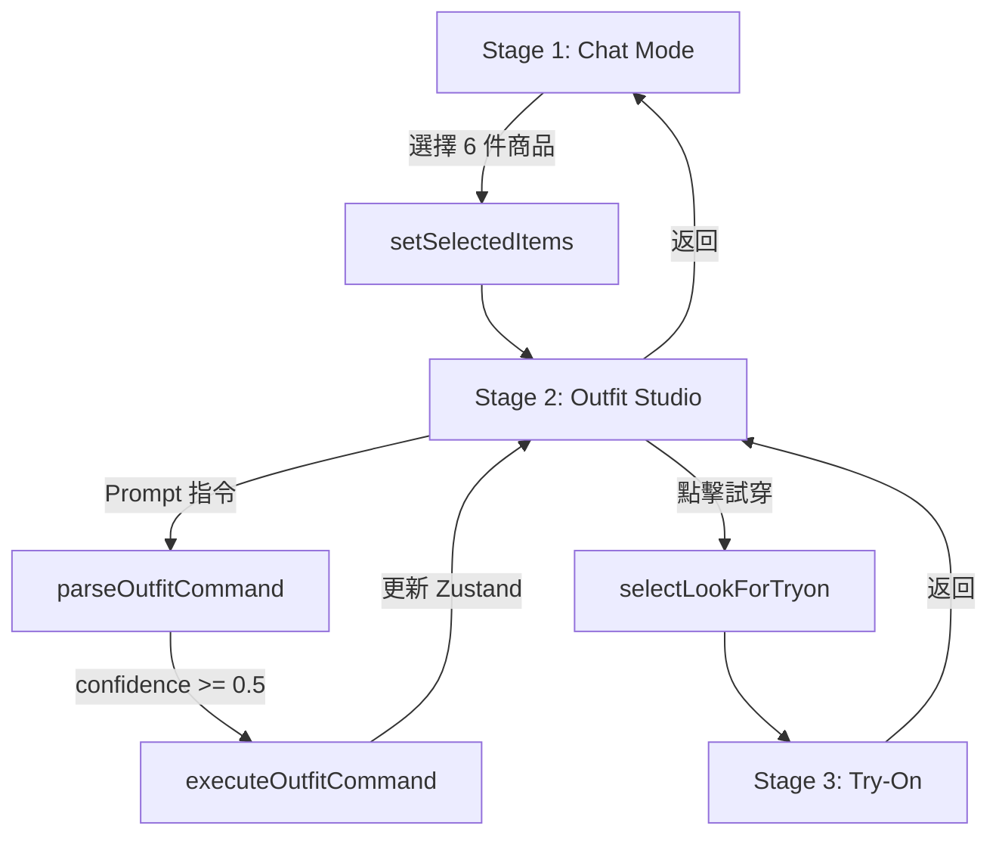

# BE 27 整合指南

## 📋 目錄
1. [系統概述](#系統概述)
2. [安裝步驟](#安裝步驟)
3. [核心檔案](#核心檔案)
4. [使用流程](#使用流程)
5. [技術架構](#技術架構)
6. [測試與部署](#測試與部署)

---

## 系統概述

BE 27 是一個完整的 **AI 驅動穿搭規劃系統**，整合了以下功能：

### ✨ 三階段用戶旅程

```
Stage 1: Chat 對話推薦
👤 "幫我找春天約會穿搭"
🤖 AI 推薦 9 件商品
👆 用戶選擇 3 上衣 + 3 下身
↓

Stage 2: Outfit Studio 穿搭工作室
🤖 自動生成 6 套 LOOK 組合
👆 拖拽調整 + Prompt 指令操作
🎯 選擇最喜歡的一套
↓

Stage 3: Virtual Try-On 虛擬試穿
📸 上傳用戶照片
🤖 Nano Banana AI 生成試穿效果
✅ 查看真實穿搭結果
```

### 🎯 核心特色

- **閉環商品池**：6 件商品（3 上衣 + 3 下身）生成所有 LOOK
- **智能指令系統**：自然語言控制穿搭調整
- **實時 AI 對話**：左側 Chat 欄位持續提供建議
- **狀態管理**：Zustand 全局狀態，跨階段無縫切換

---

## 安裝步驟

### 1. 安裝依賴套件

```bash
cd frontend
npm install zustand react-dnd react-dnd-html5-backend
```

### 2. 檔案結構確認

確保以下檔案存在：

```
frontend/
├── store/
│   └── outfitStore.ts              # ✅ Zustand 狀態管理
├── lib/core/
│   ├── outfitCommandParser.ts      # ✅ Prompt 指令解析器
│   ├── intentParser.ts             # ✅ 已存在（Intent 分析）
│   └── intentRules.ts              # ✅ 已存在
├── app/chat/
│   ├── page.tsx                    # ⚠️ 原始版本（備份）
│   └── page-be27.tsx               # ✅ 新版 BE 27 整合
└── lib/products.ts                 # ✅ 已存在（商品資料庫）
```

### 3. 啟用 BE 27 新版頁面

**方案 A：直接替換（建議先備份）**
```bash
cd frontend/app/chat
cp page.tsx page.backup.tsx
cp page-be27.tsx page.tsx
```

**方案 B：測試用路由**
```bash
# 訪問 http://localhost:3002/chat-be27
# 需要在 app/ 目錄下創建 chat-be27/page.tsx
```

### 4. 啟動開發伺服器

```bash
cd frontend
npm run dev
```

訪問：http://localhost:3002/chat

---

## 核心檔案

### 1. `/frontend/store/outfitStore.ts`

**Zustand 全局狀態管理**

#### 主要狀態

```typescript
interface OutfitState {
  currentMode: 'chat' | 'outfit' | 'tryon'  // 當前階段
  selectedTops: Product[]                    // 3 件上衣池
  selectedBottoms: Product[]                 // 3 件下身池
  looks: Look[]                              // 6 套 LOOK 組合
  visibleLookCount: 3 | 6                    // 顯示數量
  selectedLookForTryon: number | null        // 試穿選擇
}
```

#### 核心方法

```typescript
// 設定商品池（進入 Stage 2）
setSelectedItems(tops: Product[], bottoms: Product[])

// 交換商品
swapItems(lookId1: number, lookId2: number, itemType: 'top' | 'bottom')

// 替換商品
replaceItem(lookId: number, itemType: 'top' | 'bottom', newIndex: number)

// 隨機重組
shuffleLooks()

// 切換顯示數量
setVisibleLookCount(count: 3 | 6)

// 選擇試穿
selectLookForTryon(lookId: number)
```

#### 使用範例

```typescript
import { useOutfitStore } from '@/store/outfitStore'

function MyComponent() {
  const { looks, setVisibleLookCount } = useOutfitStore()

  return (
    <button onClick={() => setVisibleLookCount(3)}>
      只顯示前 3 套
    </button>
  )
}
```

---

### 2. `/frontend/lib/core/outfitCommandParser.ts`

**自然語言指令解析系統**

#### 支援的指令類型

| 指令類型 | 範例 | 參數需求 |
|---------|------|---------|
| `swap` | "交換 LOOK 1 和 LOOK 3 的褲子" | lookId1, lookId2, itemType |
| `replace` | "把 LOOK 2 的上衣換掉" | lookId1, itemType, newIndex |
| `show_count` | "只顯示前 3 套" | count (3 or 6) |
| `shuffle` | "重新組合全部" | 無 |
| `select_tryon` | "試穿 LOOK 4" | lookId1 |

#### API 使用

```typescript
import { parseOutfitCommand, executeOutfitCommand } from '@/lib/core/outfitCommandParser'

// 解析指令
const command = parseOutfitCommand("交換 LOOK 1 和 LOOK 3 的褲子")
console.log(command)
// {
//   type: 'swap',
//   params: { lookId1: 1, lookId2: 3, itemType: 'bottom' },
//   rawText: "交換 LOOK 1 和 LOOK 3 的褲子",
//   confidence: 0.95
// }

// 執行指令
const result = executeOutfitCommand(command)
console.log(result)
// { success: true, message: "已交換 LOOK 1 和 LOOK 3 的褲子" }
```

#### 信心度機制

- **0.9-1.0**: 極高信心，直接執行
- **0.7-0.9**: 高信心，執行並確認
- **0.5-0.7**: 中等信心，執行但可能需要用戶確認
- **< 0.5**: 低信心，拒絕執行，提示用戶

---

### 3. `/frontend/app/chat/page-be27.tsx`

**主頁面組件（BE 27 完整整合）**

#### 三階段渲染邏輯

```typescript
export default function ChatPage() {
  const { currentMode } = useOutfitStore()

  // Stage 1: Chat Mode
  if (currentMode === 'chat') {
    return <ChatInterface />
  }

  // Stage 2: Outfit Studio
  if (currentMode === 'outfit') {
    return <OutfitStudio />
  }

  // Stage 3: Try-On
  if (currentMode === 'tryon') {
    return <TryOnInterface />
  }
}
```

#### 商品選擇邏輯（Stage 1 → Stage 2）

```typescript
const startOutfitSelection = () => {
  // 驗證選擇
  const tops = selectedProducts.filter(p => p.category === 'top')
  const bottoms = selectedProducts.filter(p => p.category === 'bottom')

  if (tops.length !== 3 || bottoms.length !== 3) {
    alert('請選擇 3 件上衣和 3 件下身！')
    return
  }

  // 進入 Outfit Mode
  setSelectedItems(tops, bottoms)  // Zustand 方法
  setMode('outfit')
}
```

#### Prompt 整合（Stage 2 中）

```typescript
const sendMessage = async () => {
  const userMessage = inputValue.trim()

  // 🎯 在 outfit 模式中，優先檢查是否為穿搭指令
  if (currentMode === 'outfit') {
    const command = parseOutfitCommand(userMessage)

    if (command.confidence >= 0.5) {
      const result = executeOutfitCommand(command)
      setMessages(prev => [...prev, {
        type: 'ai',
        content: result.success ? `✅ ${result.message}` : `❌ ${result.message}`
      }])
      return  // 不調用 OpenAI API
    }
  }

  // 一般對話流程（調用 /api/chat/recommend）
  const response = await fetch('/api/chat/recommend', { ... })
}
```

---

## 使用流程

### 完整用戶旅程

#### Stage 1: Chat 對話

1. 用戶輸入需求："幫我找春天約會穿搭"
2. AI 推薦 9 件商品（3 上衣 + 3 下身 + 3 其他）
3. 用戶點擊商品卡片選擇（選中會有紫色邊框 + ✓）
4. 選滿 6 件後，「開始挑選穿搭」按鈕啟用
5. 點擊按鈕 → 進入 Stage 2

#### Stage 2: Outfit Studio

**畫面配置**：
- 左側 (1/5 寬度)：BE 27 聊天欄位
- 右側 (4/5 寬度)：6 套 LOOK 卡片展示

**用戶操作**：
```
方式 1: 按鈕控制
- 點擊「顯示 3 套」或「顯示 6 套」

方式 2: Prompt 指令
- 輸入："只顯示前 3 套"
- 輸入："交換 LOOK 1 和 LOOK 3 的褲子"
- 輸入："重新組合全部"

方式 3: 試穿（進入 Stage 3）
- 點擊任何 LOOK 卡片的「試穿這套」按鈕
```

**AI 回應範例**：
```
✅ 已交換 LOOK 1 和 LOOK 3 的褲子
✅ 已切換為顯示 3 套穿搭
✅ 已重新組合全部穿搭！
```

#### Stage 3: Virtual Try-On

**功能**（待整合 Nano Banana）：
1. 顯示選中的 LOOK 詳情
2. 上傳用戶照片
3. 調用 Nano Banana API 生成試穿結果
4. 展示結果圖像
5. 返回 Outfit Studio 或繼續試穿其他 LOOK

---

## 技術架構

### 狀態流轉圖



### 數據結構

#### LOOK 組合邏輯

```typescript
// 6 件商品池
selectedTops: [Top1, Top2, Top3]
selectedBottoms: [Bottom1, Bottom2, Bottom3]

// 6 套 LOOK（通過 index 指向商品池）
looks: [
  { id: 1, topIndex: 0, bottomIndex: 0 },  // Top1 + Bottom1
  { id: 2, topIndex: 0, bottomIndex: 1 },  // Top1 + Bottom2
  { id: 3, topIndex: 0, bottomIndex: 2 },  // Top1 + Bottom3
  { id: 4, topIndex: 1, bottomIndex: 0 },  // Top2 + Bottom1
  { id: 5, topIndex: 1, bottomIndex: 1 },  // Top2 + Bottom2
  { id: 6, topIndex: 1, bottomIndex: 2 },  // Top2 + Bottom3
]
```

**優點**：
- 交換商品只需改變 index，無需移動實際商品對象
- 保持商品池固定，符合「閉環系統」設計
- 隨機重組只需打亂 index 組合

#### 完整 LOOK 資訊獲取

```typescript
import { getFullLook } from '@/store/outfitStore'

const look = { id: 1, topIndex: 0, bottomIndex: 1 }
const fullLook = getFullLook(look, selectedTops, selectedBottoms)

console.log(fullLook)
// {
//   top: { id: 10, name: "白色襯衫", price: 1200, ... },
//   bottom: { id: 25, name: "黑色西裝褲", price: 1800, ... },
//   totalPrice: 3000
// }
```

---

## 測試與部署

### 本地測試流程

#### 1. 功能測試清單

**Stage 1 測試**：
- [ ] 輸入時尚查詢，AI 回應正常
- [ ] 顯示 9 件推薦商品
- [ ] 點擊商品，選中狀態正確（紫色邊框 + ✓）
- [ ] 選擇數量顯示正確（已選擇 X/6）
- [ ] 選滿 6 件，按鈕啟用
- [ ] 選擇不符合規則（例如 4 上衣 + 2 下身），顯示警告
- [ ] 點擊「開始挑選穿搭」，進入 Stage 2

**Stage 2 測試**：
- [ ] 左側 Chat 欄位正常顯示
- [ ] 右側顯示 6 套 LOOK 卡片
- [ ] 每個 LOOK 顯示上衣、下身、總價
- [ ] 點擊「顯示 3 套」，只顯示前 3 套
- [ ] 點擊「顯示 6 套」，顯示全部
- [ ] 輸入指令："交換 LOOK 1 和 LOOK 3 的褲子"，執行成功
- [ ] 輸入指令："重新組合全部"，LOOK 重新排列
- [ ] 點擊「試穿這套」，進入 Stage 3

**Stage 3 測試**：
- [ ] 顯示選中的 LOOK 詳情
- [ ] 上傳按鈕可點擊（功能待整合）
- [ ] 返回按鈕正常工作

#### 2. Prompt 解析器測試

```typescript
// 在 outfitCommandParser.ts 中已包含測試用例
import { TEST_COMMANDS } from '@/lib/core/outfitCommandParser'

TEST_COMMANDS.forEach(cmd => {
  const result = parseOutfitCommand(cmd)
  console.log(`指令: ${cmd}`)
  console.log(`類型: ${result.type}`)
  console.log(`信心度: ${result.confidence}`)
})
```

**預期結果**：
| 指令 | 類型 | 信心度 |
|-----|------|--------|
| "交換 LOOK 1 和 LOOK 3 的褲子" | swap | 0.95 |
| "只顯示前 3 套" | show_count | 0.9 |
| "重新組合全部" | shuffle | 0.95 |
| "我要試穿 LOOK 4" | select_tryon | 0.9 |

#### 3. Zustand 狀態測試

```typescript
// 在瀏覽器 Console 中測試
import { useOutfitStore } from '@/store/outfitStore'

const store = useOutfitStore.getState()

// 測試設定商品池
store.setSelectedItems(
  products.filter(p => p.category === 'top').slice(0, 3),
  products.filter(p => p.category === 'bottom').slice(0, 3)
)

console.log(store.looks)  // 應該有 6 個 LOOK

// 測試交換
store.swapItems(1, 3, 'bottom')
console.log(store.looks)  // LOOK 1 和 LOOK 3 的 bottomIndex 已交換
```

---

### 部署注意事項

#### 1. 環境變數檢查

```env
# /frontend/.env.local

# OpenAI API（必須）
OPENAI_KEY=sk-proj-xxx

# Hugging Face（虛擬試穿必須）
HF_SPACE_ID=amber2616/STYLEMATE
HF_TOKEN=hf_xxx

# 其他 API
OPENWEATHER_API_KEY=xxx
PINECONE_API_KEY=xxx
```

#### 2. 依賴套件版本

```json
{
  "dependencies": {
    "next": "14.0.0",
    "react": "^18.2.0",
    "zustand": "^4.4.0",
    "react-dnd": "^16.0.1",
    "react-dnd-html5-backend": "^16.0.1",
    "@heroicons/react": "^2.0.0"
  }
}
```

#### 3. 構建測試

```bash
# 檢查 TypeScript 類型錯誤
npm run type-check

# 檢查 ESLint 錯誤
npm run lint

# 構建生產版本
npm run build

# 啟動生產伺服器
npm start
```

#### 4. 效能優化

**圖片優化**：
```typescript
// 使用 Next.js Image 組件
import Image from 'next/image'

<Image
  src={product.image}
  alt={product.name}
  width={400}
  height={400}
  priority={index < 3}  // 前 3 個商品預加載
/>
```

**Zustand 持久化**（可選）：
```typescript
import { persist } from 'zustand/middleware'

export const useOutfitStore = create(
  persist<OutfitState>(
    (set) => ({ ... }),
    { name: 'outfit-storage' }
  )
)
```

---

## 常見問題

### Q1: 為什麼 LOOK 只有 6 套？

**設計理念**：
- 3 上衣 × 3 下身 = 9 種可能組合
- 取前 6 種組合展示（避免過多選擇造成決策疲勞）
- 用戶可通過「重新組合」功能獲得不同搭配

**可擴展**：
```typescript
// 如果要顯示全部 9 套
const initializeLooks = (): Look[] => {
  const combinations: Look[] = []
  for (let t = 0; t < 3; t++) {
    for (let b = 0; b < 3; b++) {
      combinations.push({ id: t*3 + b + 1, topIndex: t, bottomIndex: b })
    }
  }
  return combinations  // 返回 9 套
}
```

### Q2: Prompt 指令無法識別怎麼辦？

**檢查步驟**：
1. 確認信心度：`console.log(command.confidence)`
2. 檢查正則匹配：測試 `COMMAND_PATTERNS` 中的正則
3. 添加更多同義詞：
   ```typescript
   const COMMAND_PATTERNS = {
     swap: /交換|換|互換|對調|swap|exchange/i,  // 新增「對調」
   }
   ```

### Q3: 如何整合 Nano Banana API？

**參考現有實現**：
```typescript
// /frontend/app/api/tryon/route.ts（已存在）
// 複製相關邏輯到 Stage 3 頁面

const handleTryOn = async (userPhoto: File) => {
  const formData = new FormData()
  formData.append('person', userPhoto)
  formData.append('garment_top', fullLook.top.image)
  formData.append('garment_bottom', fullLook.bottom.image)

  const response = await fetch('/api/tryon/route', {
    method: 'POST',
    body: formData
  })

  const result = await response.json()
  setTryOnResult(result.image_url)
}
```

### Q4: 如何返回 Chat Mode？

**兩種方式**：
```typescript
// 方式 1：點擊返回按鈕
<button onClick={() => setMode('chat')}>
  <ArrowLeftIcon /> 返回
</button>

// 方式 2：Zustand 方法
const { resetOutfit } = useOutfitStore()
resetOutfit()  // 重置所有狀態並返回 chat
```

---

## 下一步開發

### 短期（1-2 週）

- [ ] **React DnD 整合**：實現拖拽交換商品
- [ ] **Nano Banana API**：完成虛擬試穿功能
- [ ] **動畫效果**：LOOK 卡片切換、商品交換動畫
- [ ] **響應式設計**：適配平板、手機

### 中期（3-4 週）

- [ ] **一周穿搭生成**：AI 自動規劃 Monday-Sunday 7 套
- [ ] **穿搭歷史記錄**：保存用戶的 LOOK 組合
- [ ] **分享功能**：生成穿搭圖片分享
- [ ] **商品收藏**：標記喜歡的商品

### 長期（1-2 月）

- [ ] **社群功能**：查看其他用戶穿搭
- [ ] **風格分析**：AI 學習用戶偏好
- [ ] **購物車整合**：直接購買 LOOK 中的商品
- [ ] **AR 試穿**：手機相機實時試穿

---

## 技術支援

### 文檔參考

- **BE 27 開發者文檔**：`/docs/BE27_DEVELOPER_DOCUMENTATION.md`
- **STYLEMATE 系統架構**：`/docs/DEVELOPER_DOCUMENTATION.md`
- **Intent Parser 文檔**：`/frontend/lib/core/intentParser.ts`

### 聯絡資訊

- **專案負責人**：STYLEMATE 團隊
- **技術支援**：查看 `/docs/` 目錄下的文檔
- **GitHub Issues**：提交問題與建議

---

## 附錄

### A. Prompt 指令完整範例

```typescript
// 交換指令
"交換 LOOK 1 和 LOOK 3 的褲子"
"LOOK 2 的上衣換成 LOOK 5 的上衣"
"把 LOOK 1 和 LOOK 4 的下身對調"

// 顯示控制
"只顯示前 3 套"
"顯示全部 6 套穿搭"
"只看前三套"

// 重組
"重新組合全部"
"隨機排列"
"打亂全部搭配"

// 試穿
"試穿 LOOK 4"
"我要穿這套"
"看看 LOOK 2 的試穿效果"
```

### B. TypeScript 類型定義

```typescript
// Look 類型
interface Look {
  id: number
  topIndex: number    // 0-2
  bottomIndex: number // 0-2
}

// OutfitCommand 類型
interface OutfitCommand {
  type: 'swap' | 'replace' | 'show_count' | 'shuffle' | 'select_tryon' | 'unknown'
  params: {
    lookId1?: number
    lookId2?: number
    itemType?: 'top' | 'bottom'
    newIndex?: number
    count?: 3 | 6
  }
  rawText: string
  confidence: number
}

// BE27Mode 類型
type BE27Mode = 'chat' | 'outfit' | 'tryon'
```

---

**版本**：1.0.0
**最後更新**：2025-01-XX
**作者**：Claude Code + STYLEMATE Team
